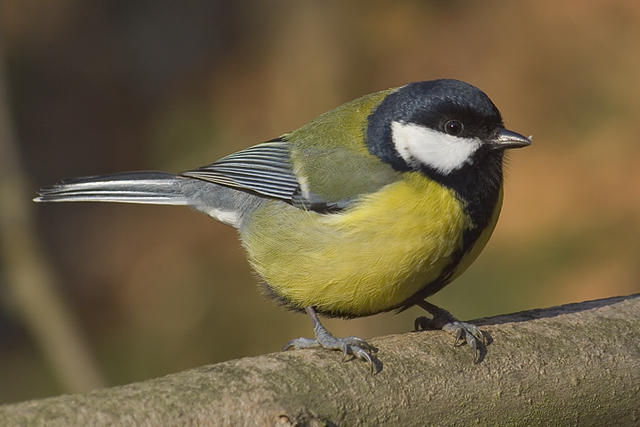

**Talgoxe** ( Parus major)

_Talgoxen är en kraftig liten mes med gul undersida,svart huvud och vita kinder.Den har mossgrön rygg. Hannens bröstband är bredare än honans,den breddas till en svart fläck på buken. Den häckar i skog,parker_ _och trädgårdar i hela Sverige och den är en stannfågel.den kommer gärna in i bebyggelsen och till fågelborden på vintern, men är också en flitig besökare på sommaren.Tiden för häckningen varierar beroende på olika omständigheter, men i Europa inleds den vanligtvis efter mars månad. Den häckar gärna i holkar och är en hålhäckare.  På menyn står insekter,spindlar,frön,bokollon och frukt.Och som namnet antyder tycker den om talgbollar. Hos oss är den en daglig gäst vid matbordet. Längd: 12-14 cm. Vingspann: 23-26 cm. Vikt: 20 gram. Livslängd: Upp till 15 år._

Bilder [Falknatur](http://www.falknatur.se/arter/talgoxe.htm) Bilder [Vingspann](http://www.vingspann.se/talgoxe1.htm) Talgoxe bilder och läte

https://www.youtube.com/watch?v=ByuDiuDpFLg https://www.youtube.com/watch?v=BIT7piVmFmk https://www.youtube.com/watch?v=hXq7BSQo9U4 https://www.youtube.com/watch?v=YnaY4txOPqQ Talgoxe filmer

Vi ses imorgon igen med en ny fågel vid bordet.
