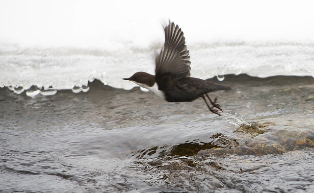

**Strömstare, Dippers** ( Cinclus Cinclus )

 _Strömstaren är kompakt byggd med kraftiga ben och kort stjärt som ofta hålls uppåtriktad.Den är mörk med stor vit haklapp,vanligen sotsvart eller bruntonad på huvudet och rostbrun nedanför haklappen.Ungfågeln har blackt grå dräkt med ljus vattring ovan och mörk vattring under.Den ljusa haklappen kan anas.Den häckar vid strömma grunda vattendrag i skogs eller bergstrakter,helst intill flacka forsar med exponerade stenar som lämpar sig som sittplats.Den dyker efter insekter och andra vattendjur.Den simmar under vattnet med vingarnas hjälp och kan även gå på bottnen.Den vinterbadar och hoppar i från iskanten.Boet är svårtillgängligt placerat på klipp eller kvarnvägg över vattnet eller till och med under vattenfall,täckt med ingång från sidan och byggt av strån och mossa.Den är delvis flyttfågel. Längd: 17-20 cm. Vingspann: 26-30 cm. Vikt: 55-73 gram._

Bilder [Falknatur](http://www.falknatur.se/arter/stromstare.htm) Bilder [Vingspann](http://www.vingspann.se/stromstare1.htm) Strömstare bilder och läte

\[embed\]http://www.youtube.com/watch?v=PUKutYeO\_FQ\[/embed\] \[embed\]http://www.youtube.com/watch?v=Ie--ltC9ncc\[/embed\] Strömstare filmer.

Vi ses här på Fredag igen
