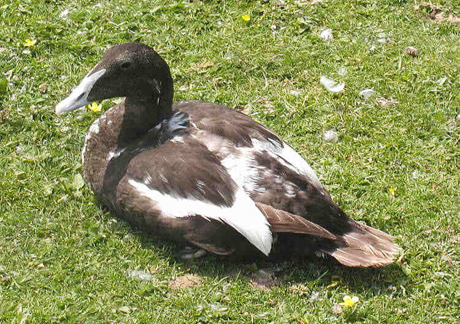

**Ejder, Eider** ( Somateria mollissima )

 _Ejdern är en stor dykand som är havslevande. Hannen är omisskännlig i svart och vitt med grön nackfläck. Utanför häckningstiden är den han mörkare och flammigare, ibland nästan helt utan rent vita partier. Honan är brunspräcklig. Huvudformen är karakteristisk hos båda könen med lång näbb och sluttande panna. Den är kustbunden och häckar i skärgårdarna samt vid steniga och klippiga avsnitt längs hela Sveriges kust. Den är en flyttfågel som övervintrar i södra Östersjön och östra Nordsjön. Den dyker på jakt efter blåmusslor och olika kräftdjur.Kan häcka stora kolonier med åtskilliga tusen par._ _Boet läggs vanligen i lä mellan några grästuvor, i en skreva eller bakom en sten, men ibland helt öppet. Boet brukar bestå av en grop i mossan som sedan kompletteras med tång, kvistar och annat som honan rycker loss. Därefter tätas boet med ejderdunet som honan plockar från sin egen kropp, främst ifrån bröstet, och som läggs som en tjock krans i redet._ _Längd: 60-70 cm. Vingspann: 90-105 cm. Vikt: 1.915-2.218 kg_. _Livslängd:_ _Upp till 37 år och 10 månader._

Bilder [Falknatur](http://www.falknatur.se/arter/ejder.htm) Bilder [Vingspann](http://www.vingspann.se/ejder1.htm) Bilder [Glenn Bartley](http://www.glennbartley.com/naturephotography/birds/COMMON%20EIDER.htm) Ejder bilder och läte

https://www.youtube.com/watch?v=vZFdv0wxX5A https://www.youtube.com/watch?v=oWCns9g9Gno https://www.youtube.com/watch?v=yrypJgdINb8 Ejder filmer

Ny gäst på måndag.
