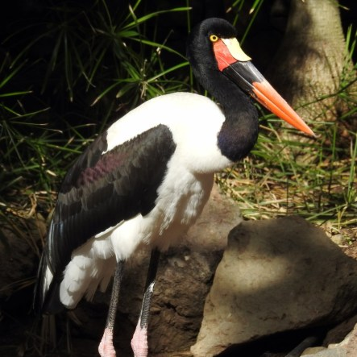
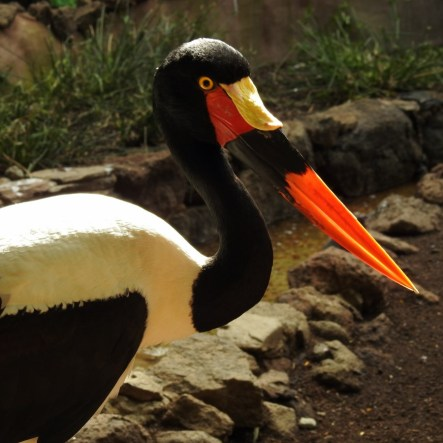
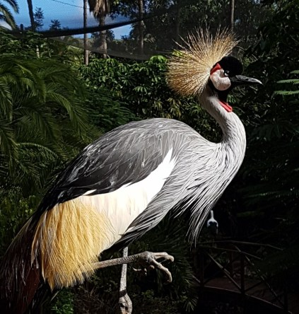
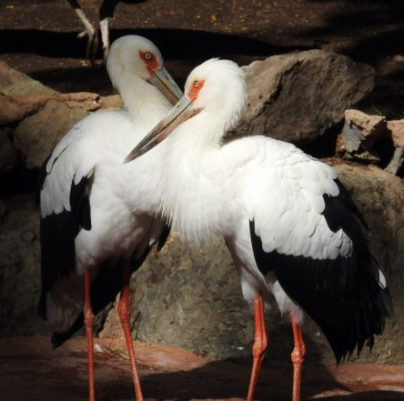

**Fåglar i Palmitos Park och Loro Parque**

_Här är ett litet urval av fåglar från Palmitos Park i Maspalomas och Loro Parque i Teneriffa._

 _Berguv. Eagle Owl._

 _Vithövdad havsörn. Bold Eagle._

 _Sadelnäbbstork. Saddle-billed stork._

 _Krontrana. Crown Crane._

 _Jungfrutrana. Demoiselle Crane._

 _Vit stork. White Stork._

 _Nikobarduva. Nicobar Pidgeon._

 _Vittofskakadua. White Cockatoo._

 _Rödsidad ädelpapegoja. Red-headed parrot._

 _Grön papegoja. Green Parrot._

 _Guldfasan. Golden Pheasant._

 _Blå kronduva. Western Crowned Pigeon._
