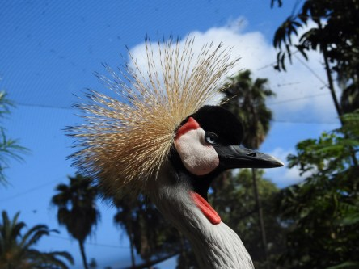
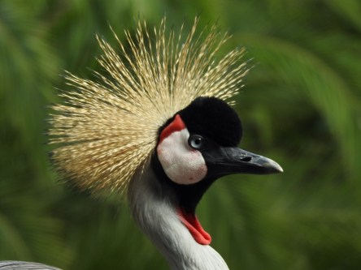
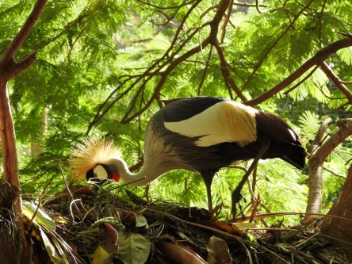

**Krontrana i Palmitos Park**

 _Jag_ _har äntligen fått se och ta bilder på nära håll på denna fantastiska fågel, som är en av mina absoluta favoriter. Dessa bilder är från vår resa till Gran Canaria där vi besökte den helt underbara Palmitos Park. Dessa bilder har min son Johannes tagit. Jag kommer att lägga upp mina bilder längre fram._

Fler fåglar kommer i nästa inlägg från Gran Canaria.
