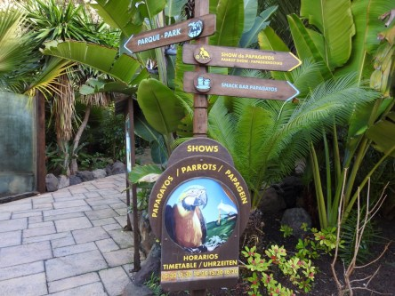
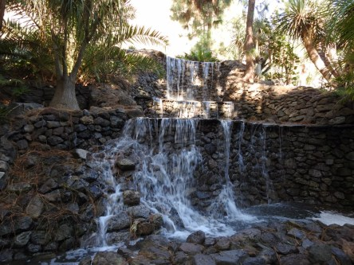
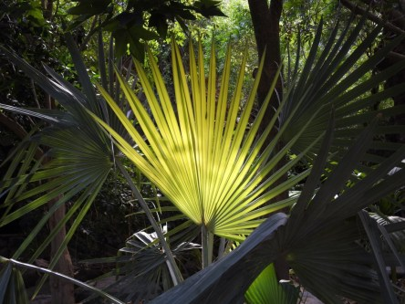
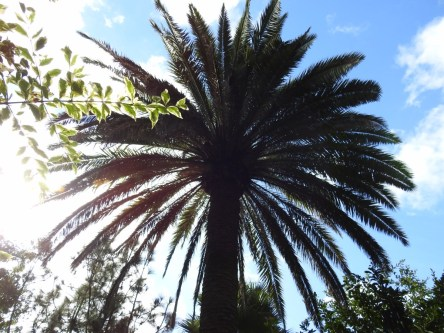
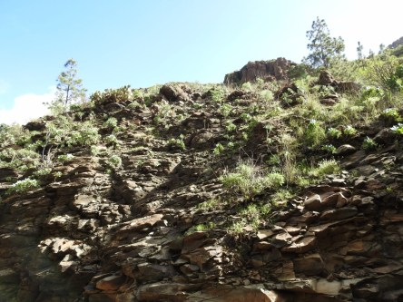
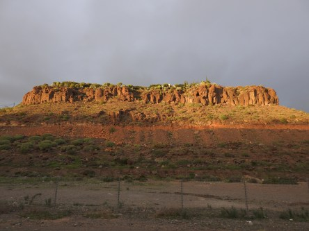

**Palmitos vackra natur**

_Här är ett litet urval av bilder från den vackra parken Palmitos i Maspalomas._

 _Helt fantastisk och skiftande natur i den här parken._ _Den kan verkligen rekommenderas för den som åker till Gran Canaria._

 _På vägen hem gick solen ner över bergen och det mulnade och blev mörkt snabbt efter en solig härlig dag._
