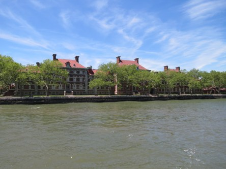
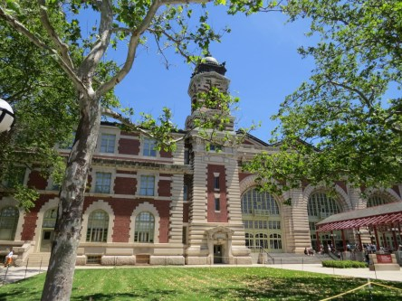
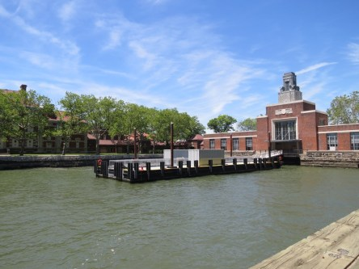
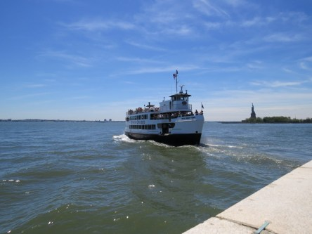
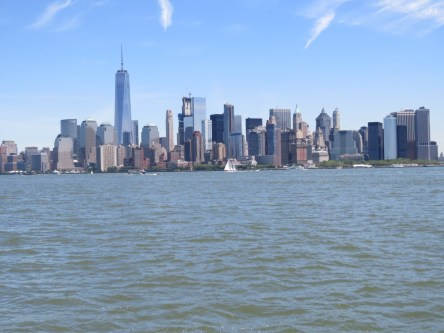
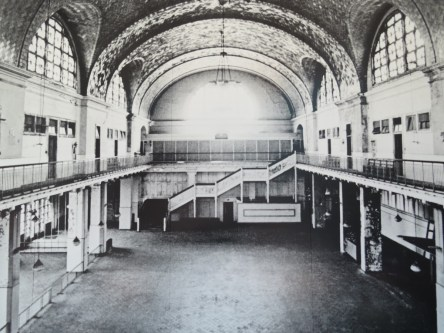
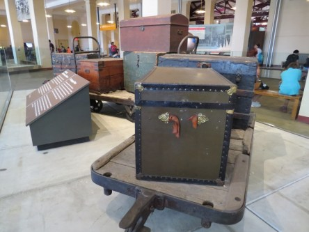
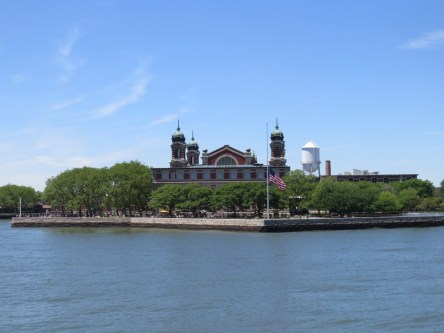

**Ellis Island**

_Idag visar jag lite bilder från den lilla ön Ellis Island i New York, dit många immigranter kom på 1800-talet. Du kan läsa mer om Ellis Island [här](https://sv.wikipedia.org/wiki/Ellis_Island)._

 _Vy från båten på väg mot ön._

 _Huvudbyggnaden på ön dit immigranterna kom._

 _Utsikt mot andra sidan på ön._

 _Utsikt mot Manhattan från ön._

 _Ny båt med turister på väg in mot ön._

 _Utsikt mot Frihetsgudinnan som vi precis har besökt._

 _Ytterligare en vy över Manhattan._

 _Den stora huvudsalen i nutid._

 _Och i dåtid._

 _Det var inte lika lätt att färdas med bagage på den tiden._

 _Nu lämnar vi ön och styr mot Manhattan igen._

Hoppas ni fått en uppfattning om hur den lilla ön som haft så stor betydelse för immigranterna ser ut.
