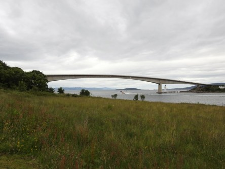
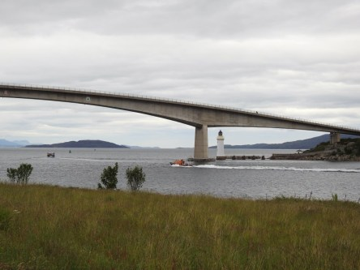
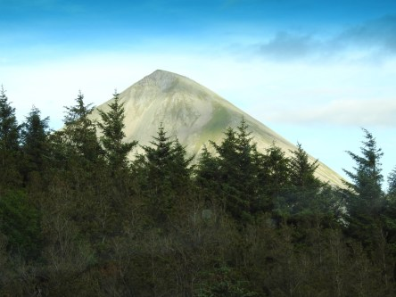
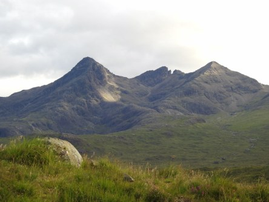
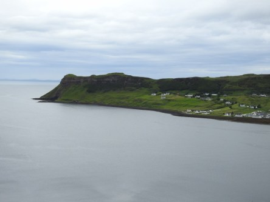
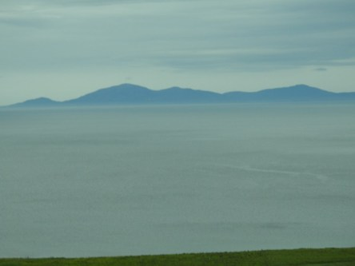
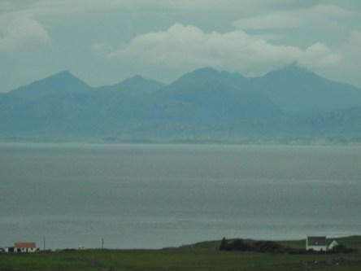
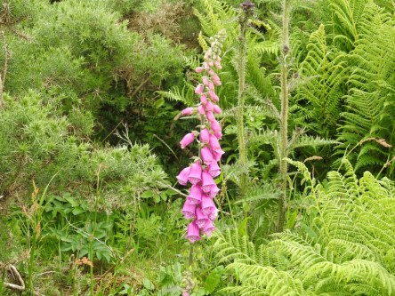
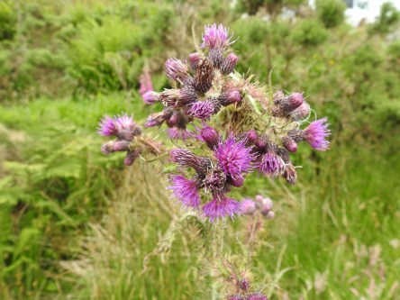

**Isle of Skye**

_På Isle of Skye finns något av Skottlands mest fantastiska naturupplevelser med vulkaner, höga berg, klippor, vattenfall och djupa dalar. Hur mycket man än ser så finns det lika mycket till att se och uppleva._

 _Bron över till Isle of Skye._

 

 _Vulkaner och berg överallt._

 _Vacker och dramatisk natur med vattenfall och bäckar._

 _Längst bort kan man se ända över till yttre Hebriderna._

 _Fingerborgsblommor och tistlar växer överallt._
