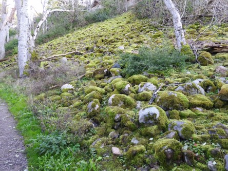
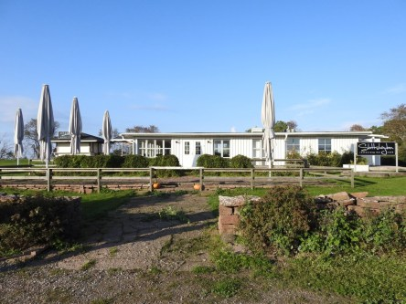
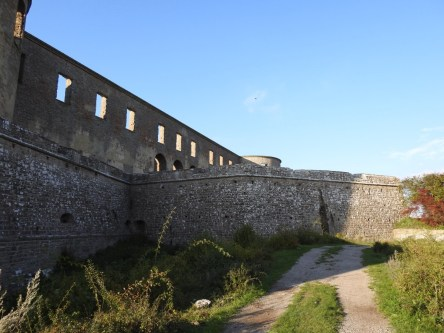
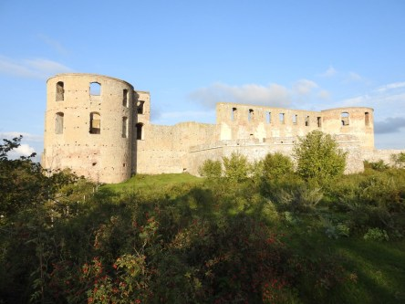
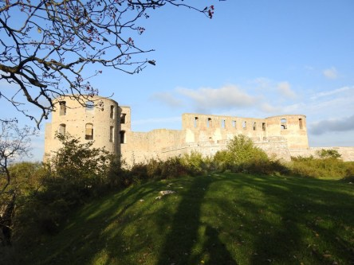

**En vandring runt Borgholms slott**

_Vi gick en runda runt Borgholms slott på Öland men tyvärr var slottet stängt när vi var där. Men här är några bilder på slottet och lite runt omkring. Det var blå himmel och vita moln den dagen vilket ger ett fint ljus till bilderna._

 _Vägen upp till slottet var inte helt lätt för den otränade._

 _Väl uppe finns ett kafe där man kan få lite att dricka, om det är öppet vill säga, hahaha._

 _Slottet i motljus._

 _Slottet sett från olika vinklar och med den vackra naturen runt omkring._
