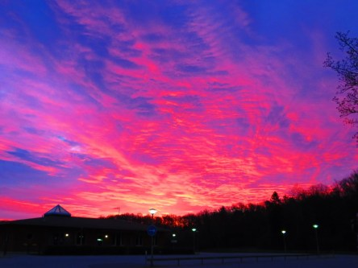
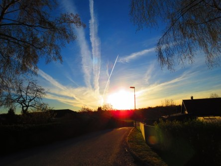
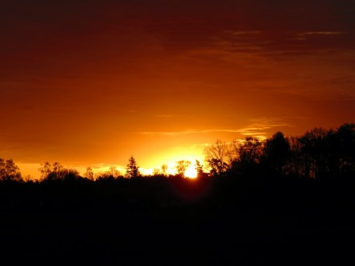

**Soluppgångar**

_Ibland tror man knappt sina ögon när man ser solen gå upp. Alla dessa fantastiska färger. Allt från illrött till knallrosa._

 _Samma sol varje morgon, men ändå så olika färger._

Spara

Spara
