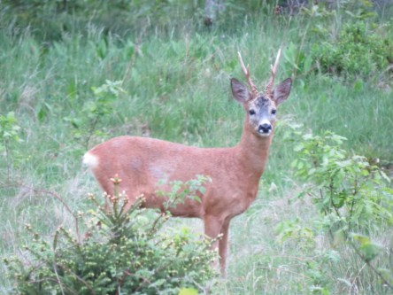
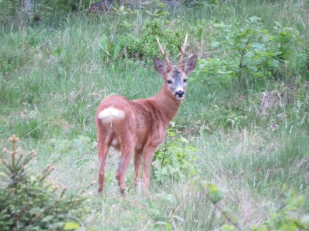

**Rådjur i tidig morgonstund**

 _För en gång skull stod ett av rådjuren helt stilla så att jag kunde ta bilder i lugn och ro. Trots att ljusförhållande inte var de bästa så tidigt och avståndet långt så blev jag väldigt nöjd med bilderna._
