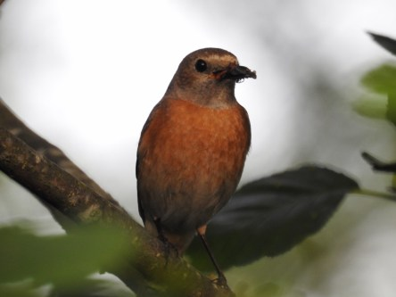
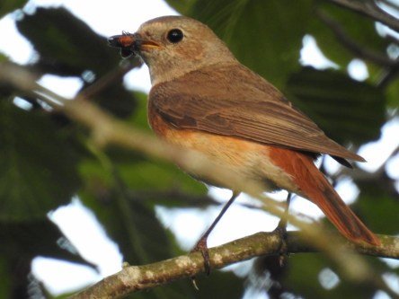
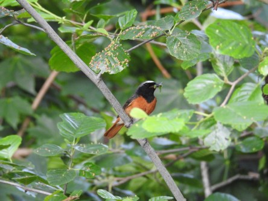
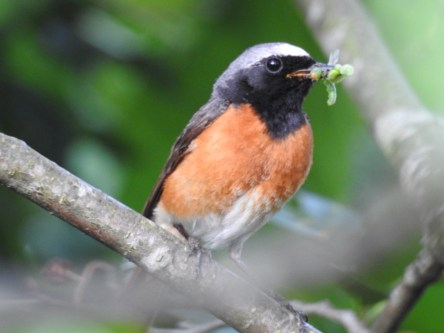
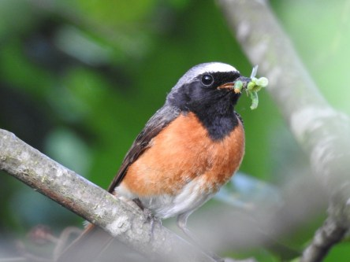

**Rödstjärtfamilj i holken**

_Till min stora lycka såg jag att ett rödstjärtspar har bosatt sig i min holk och håller just nu på med att flyga fram och tillbaks med mat åt de hungriga små ungarna. Jag hoppas att jag ska lyckas få syn på de små också så småningom._

 _Mamma rödstjärt med godsaker till de små._

 _Pappa rödstjärt har också hitta godis till de små._
