**I ruinerna av en begravd stad.**

_Det var väldigt mycket att se i den begravda staden Pompeji i Italien. En väldigt spännande och tragisk färd genom ruinerna från en en gång levande stad med människor som hade sin vardag här. Det blir väldigt många bilder i det här inlägget eftersom det är väldigt svårt att välja bara några få. Hoppas någon finner det intressant att följa med genom gatorna i den av Vesuvius aska begravda staden._

 _Pompeji. En resa tillbaks i tiden._

[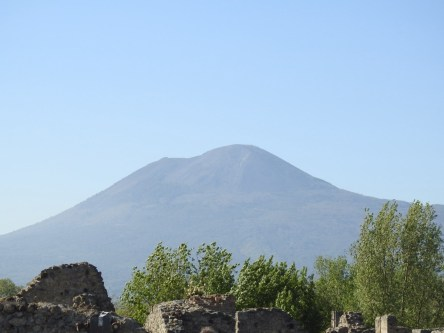](https://worldwideweatherblog.wordpress.com/wp-content/uploads/2017/04/dscn4179-desktop-resolution.jpg)

 _Långt där borta ser vi den ännu aktiva vulkanen Vesuvius som en gång i tiden begravde Pompeji med aska och dödade alla som var kvar i staden. Det väntas ett stort utbrott från vulkanen när som helst igen och det kommer att få stora konsekvenser för bland annat Neapel som ligger alldeles i närheten av Vesuvius._

[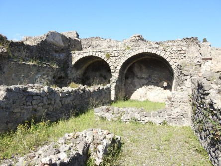](https://worldwideweatherblog.wordpress.com/wp-content/uploads/2017/04/dscn4005-desktop-resolution.jpg) _Vi vandrar längs med gatorna i staden och ser ruinerna som varsamt har tagits fram och bevarats åt eftervärlden._

[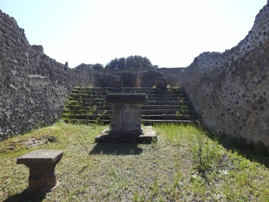](https://worldwideweatherblog.wordpress.com/wp-content/uploads/2017/04/dscn4013-desktop-resolution.jpg)

[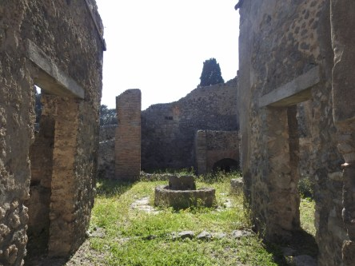](https://worldwideweatherblog.wordpress.com/wp-content/uploads/2017/04/dscn4019-desktop-resolution.jpg)

[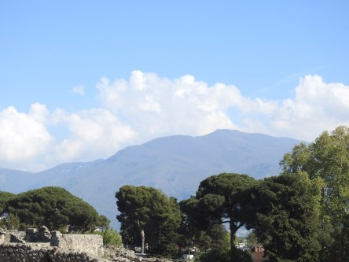](https://worldwideweatherblog.wordpress.com/wp-content/uploads/2017/04/dscn4021-desktop-resolution.jpg)

[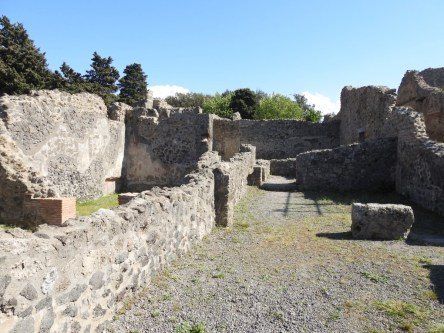](https://worldwideweatherblog.wordpress.com/wp-content/uploads/2017/04/dscn4066-desktop-resolution.jpg)

[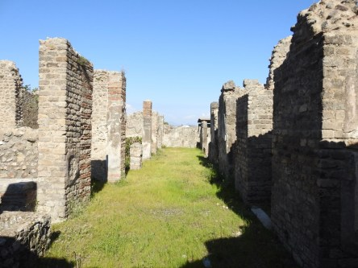](https://worldwideweatherblog.wordpress.com/wp-content/uploads/2017/04/dscn4067-desktop-resolution.jpg)

[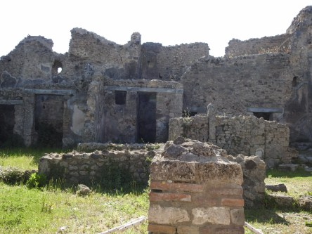](https://worldwideweatherblog.wordpress.com/wp-content/uploads/2017/04/dscn4073-desktop-resolution.jpg)

[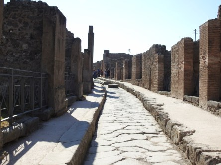](https://worldwideweatherblog.wordpress.com/wp-content/uploads/2017/04/dscn4088-desktop-resolution.jpg)

[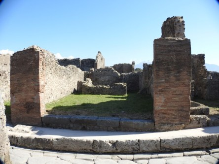](https://worldwideweatherblog.wordpress.com/wp-content/uploads/2017/04/dscn4102-desktop-resolution.jpg)

[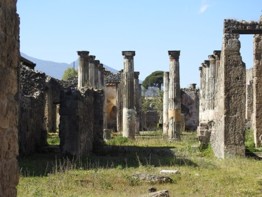](https://worldwideweatherblog.wordpress.com/wp-content/uploads/2017/04/dscn4113-desktop-resolution.jpg)  _Svårframkomliga stenlagda gator och ruiner överallt. Pompeji är inte lätt att ta sig fram i. Det krävs bekväma skor och gott om tid. Man hinner inte se allt på en dag tyvärr._

 _En man som  dog under utbrottet. Inuti gipsavgjutningen finns hans kvarlevor i exakt den ställning han satt i när han tog sitt sista andetag._

 _Här ser vi kvarlevorna efter en liten pojke som försökte värja sig mot floden av lava och aska som sköljde över staden. Det är väldigt gripande att se detta._

 _Till och med djur finns bevarade och här ser vi en varg i döds- ögonblicket._

[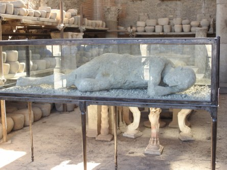](https://worldwideweatherblog.wordpress.com/wp-content/uploads/2017/04/dscn4134-desktop-resolution.jpg) _Här ligger en gravid kvinna som inte hade en chans att komma undan sitt öde. Man undrar vad hennes sista tanke var. Förmodligen på hennes ofödda barn som aldrig skulle få se dagens ljus._

[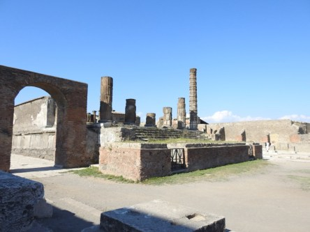](https://worldwideweatherblog.wordpress.com/wp-content/uploads/2017/04/dscn4137-desktop-resolution.jpg)

[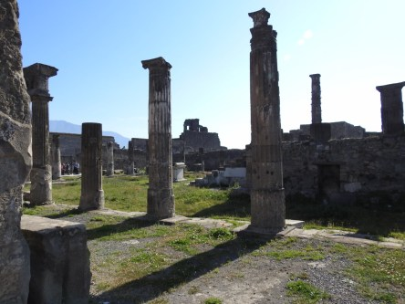](https://worldwideweatherblog.wordpress.com/wp-content/uploads/2017/04/dscn4139-desktop-resolution.jpg)

[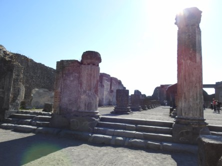](https://worldwideweatherblog.wordpress.com/wp-content/uploads/2017/04/dscn4151-desktop-resolution.jpg)

 _Vi närmar oss slutet på vår vandring och hela tiden finns den där i bakgrunden:_

 **Vesuvius!** _Den levande vulkanen!_

[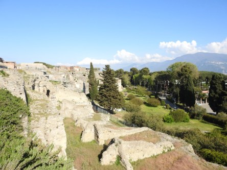](https://worldwideweatherblog.wordpress.com/wp-content/uploads/2017/04/dscn4186-desktop-resolution.jpg) _Vi lämnar nu Pompeji och lovar att snart komma tillbaks och se mer av denna fantastiska stad som en gång begravdes av vulkanen Vesuvius._

Spara
