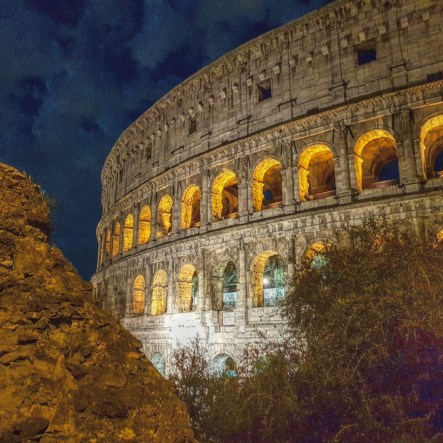
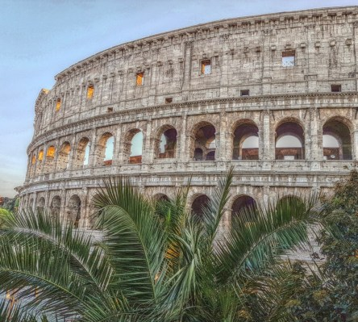
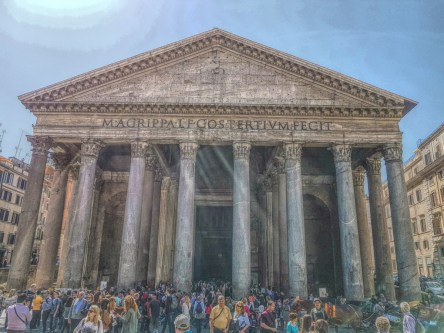
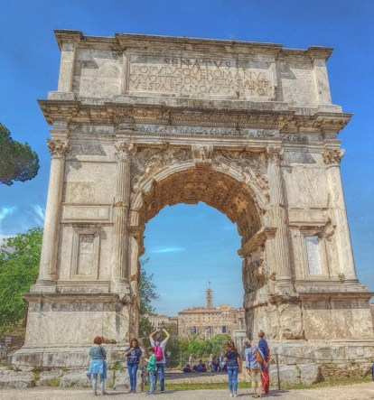
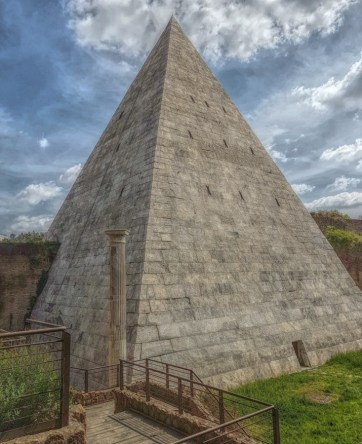

**En resa till Rom**

_Efter en vecka i Italien med Rom, Pisa, Florens, Neapel och Pompej som besökta städer finns det många bilder att välja mellan. De första jag visar är omgjorda till tecknade bilder._

 _Det första och mest självklara man ska se är naturligtvis Colosseum._

 _Nästa besöksmål är Fontana Di Trevi-Roma_

 _Castel Sant'angelo är ett sevärt slott som ligger vid Vatikanen._

 _Pantheon är ett måste i Rom._

 _Konstantinbågen vid Colosseum måste ses._

 _Cestiuspyramiden är en doldis som kanske inte alla känner till eller glömmer att besöka. Helt klart värt besväret att ta sig dit._

 _Monumento Vittorio Emanuelle är helt omöjligt att missa när man går runt i Roms centrum._

 _I Pisa är det lutande Tornet det självklara att se._

 _Ett besök i Pompej är ett stort måste om man har möjlighet att ta sig dit när man är i Italien._

_Längre fram kommer mer från vår Italienresa._
