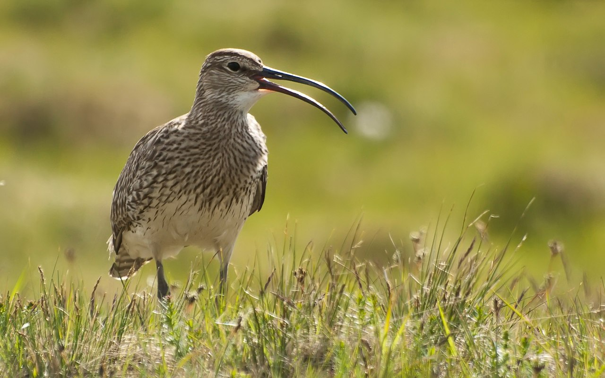

**Småspov, Whimbrel** ( Numenius phaeopus )

 

 _Notera huvudets teckning: mörkbrun hjässa med beige mittbena och ögonbrynsstreck, mörkt ögonstreck och ljusa kinder och strupe. I övrigt är fjäderdräkten spräcklig i mörkbrunt. Buken och undergumpen är ljusa. Vingband saknas, men övergumpen är vit och det vita går upp i en kil på ryggen. Lång ( 6-9 cm ) nedåtböjd näbb, som hos en liten storspov. Den häckar Island, i norra Skottland, Skandinavien och vidare in i Ryssland. Övervintrar längs västra Afrikas kust. Den häckar på fjällhedar, tundror, myrar och mossar. Vistas utanför häckningsperioden vid kusten, längs leriga eller sandiga stränder ellr klippig kust. Flyttar oftast i små flockar. Boet är en grund grop i marken, fodrat med stjälkar, torra blad och mossor. Den äter ryggradslösa djur. Längd: 37-45 cm. Vingspann: 78-88 cm. Vikt: 305-425 gram. Livslängd: Upp till 20 år, men sällan mer än 11 år._

Bilder [Falknatur](http://www.falknatur.se/arter/smaspov.htm) Bilder [Vingspann](http://www.vingspann.se/smaspov1.htm) Bilder [Lars Lundmark](http://www.larslundmark.se/smaspov.php) Småspov bilder och läte

https://www.youtube.com/watch?v=-cxR8ML4s3M

https://www.youtube.com/watch?v=8cWwwzckd9c

https://www.youtube.com/watch?v=pSEgk5PX8m8

Småspov filmer

Bilder från Wikipedia. Filmer från Youtube.
