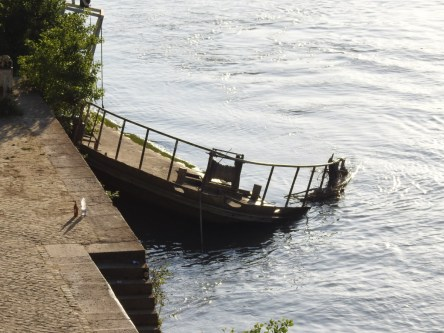
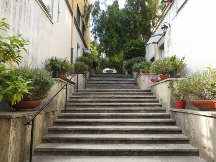
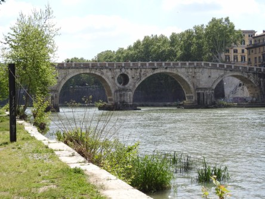
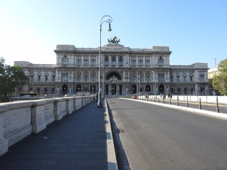
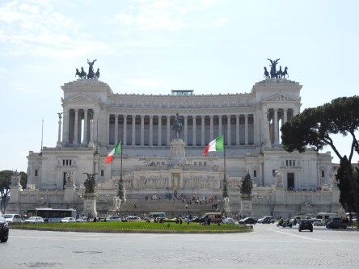
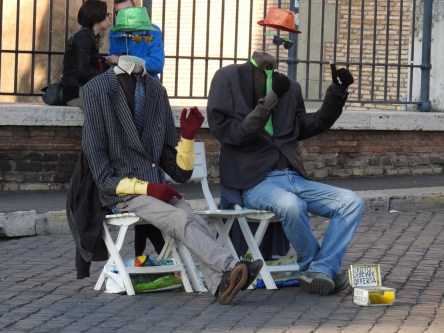

**Vardagsrom**

_Det är lätt till att man stirrar sig blind på alla sevärdheter när man är utomlands och att man glömmer bort det vardagliga. Här har jag försökt plocka fram lite av varje, vardagligt och kända saker._

 _Många är de som har upptäckt den fantastiska utsikten i Rom._

 _Som de här vyerna över Rom._

 _Vardagen i Rom kan vara väldigt sevärd._

 _En tur utmed floden bjuder på mycket vackert att se._

 _Och naturligtvis måste lite av det kända Rom vara med._

 _Knepen är många när man försöker klara sitt uppehälle i Rom._
