**Ottenby fågelstation**

_Ett besök på Ottenby fågelstation kan ge mycket för den fågelintresserade. Det är dock inte helt lätt att ta bilder för den som inte äger en ordentlig proffsutrustning i kameraväg. Men jag lyckades ändå få bilder på några fåglar som jag aldrig sett förut. En del av bilderna är tagna av min son._

 _Först några bilder på mindre exotiska fåglar från Borgholm. Grågås och Kaja._

[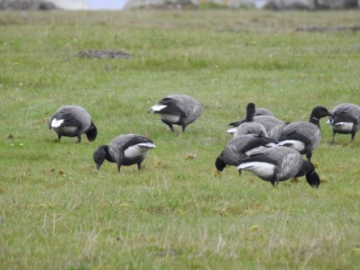](https://worldwideweatherblog.wordpress.com/wp-content/uploads/2017/10/dscn7180-desktop-resolution.jpg)

 _Väl nere i Ottenby stöter vi på dessa stripgäss. Sådana har jag aldrig sett förut._

[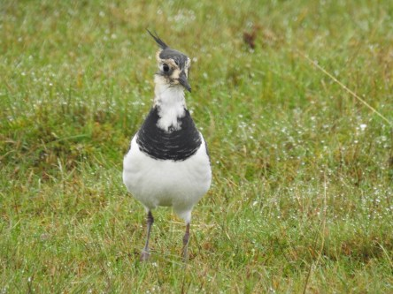](https://worldwideweatherblog.wordpress.com/wp-content/uploads/2017/10/dscn7421-desktop-resolution.jpg)

[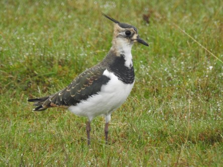](https://worldwideweatherblog.wordpress.com/wp-content/uploads/2017/10/dscn7422-desktop-resolution.jpg) _Det fanns gott om Tofsvipor överallt omkring oss. Första gången jag lyckas få bra bilder på sådana._

[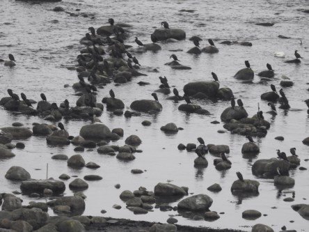](https://worldwideweatherblog.wordpress.com/wp-content/uploads/2017/10/dscn7466-desktop-resolution.jpg) _Och väldigt många skarvar._

[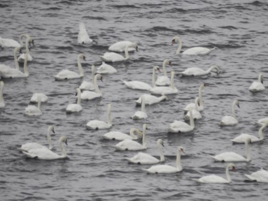](https://worldwideweatherblog.wordpress.com/wp-content/uploads/2017/10/dscn7464-desktop-resolution.jpg)

 _Det var ingen brist på svanar heller._

[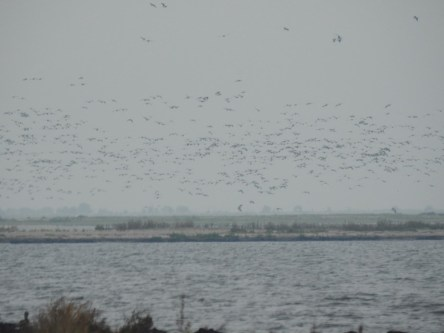](https://worldwideweatherblog.wordpress.com/wp-content/uploads/2017/10/dscn0765-desktop-resolution.jpg) _Enorma flockar med vitkindade gäss flög förbi titt som tätt._

[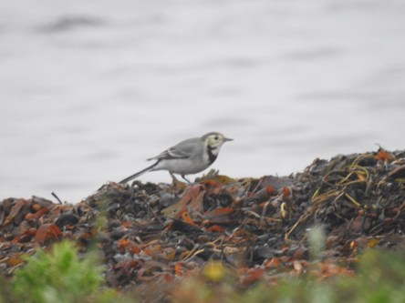](https://worldwideweatherblog.wordpress.com/wp-content/uploads/2017/10/dscn0520-desktop-resolution.jpg)

[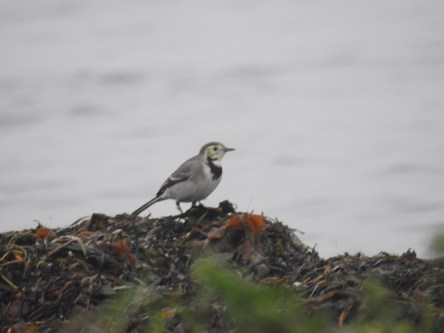](https://worldwideweatherblog.wordpress.com/wp-content/uploads/2017/10/dscn0526-desktop-resolution.jpg)

[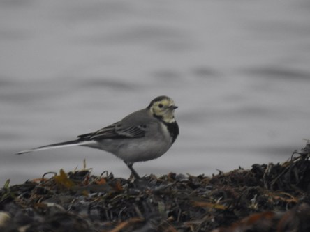](https://worldwideweatherblog.wordpress.com/wp-content/uploads/2017/10/dscn0532-desktop-resolution.jpg) _Det var fullt med citronärlor som hoppade upp och ner i luften. Den har jag aldrig sett förut heller._

[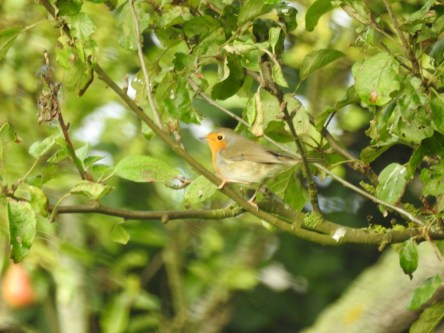](https://worldwideweatherblog.wordpress.com/wp-content/uploads/2017/10/dscn0837-desktop-resolution.jpg) _Massor av rödhakar flög runt bland träden._

 _Den här lövsångaren var betydligt svårare att fånga på bild. Johannes lyckades dock till slut att få den här bilden. Det är gången jag ser en sådan också._

[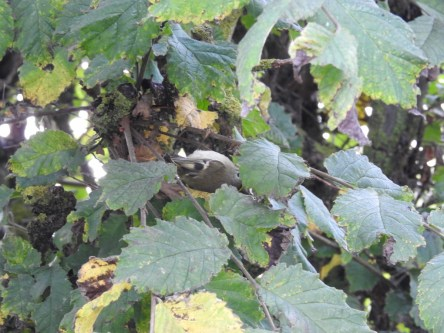](https://worldwideweatherblog.wordpress.com/wp-content/uploads/2017/10/dscn0846-desktop-resolution.jpg) _Den absolut knepigaste av dem alla var dock den här lilla kungsfågeln som man kan se mellan löven på trädet. Den var inte stilla många sekunder åt gången så det här var det bästa vi fick av den. Även här är det min son som lyckades fånga den. Även den här är det första gången jag ser._
