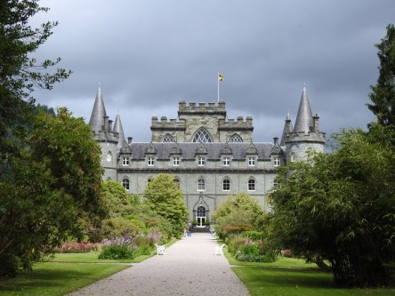
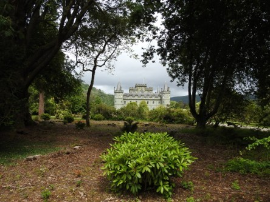
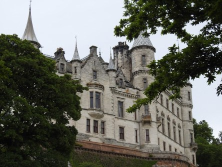

**Inveraray Castle och Dunrobin Castle**

_Det finns oändligt många slott i Skottland. En del är det bara ruiner kvar av och andra är väldigt välbevarade och i dem bor det många gånger fortfarande folk i. Andra är omgjorda till museum. Här besökte vi två slott där det fortfarande bor folk i._

 _Inveraray Castle ligger som namnet säger i Inveraray på höglandet._

 _Dunrobin Castle ligger i Sutherland på höglandet. Det ser ut över [Dornoch Firth](https://en.wikipedia.org/wiki/Dornoch_Firth)_

Spara

Spara
