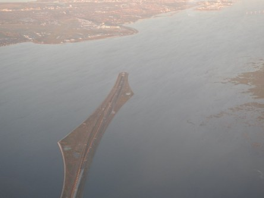
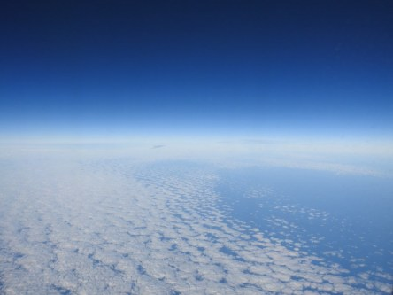
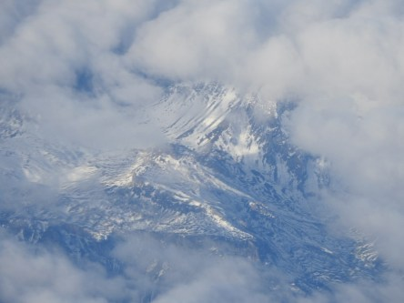
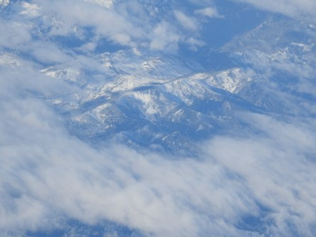
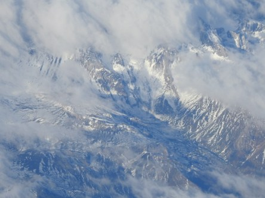

**Flygvyer på väg till Gran Canaria**

 _Allt ser annorlunda ut från ovan. Här syns Öresundsbron dyka ner i havet._

 _Hej då Danmark._

 _Molnen ser likadana ut från ovan som från nedan._

 _Snöklädda alptoppar från ovan._
