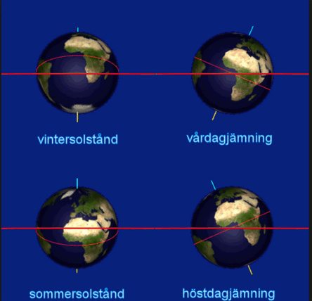
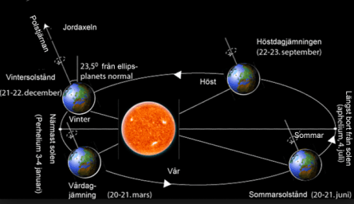

**Fredag den 22/9-17 är det höstdagjämning**

_Höstdagjämningen inträffar det ögonblick då solens centrum passerar himmelsekvatorn på väg söderut, och vårdagjämningen när solens centrum passerar himmelsekvatorn på väg norrut. Detta innebär att dagen och natten kring denna exakta tidpunkt är ungefär lika långa. Vi kallar dessa tillfällen för höstdagjämning och vårdagjämning._

_På grund av skottårscykeln varierar tidpunkten för höstdagjämningen, varför den på norra halvklotet kan inträffa antingen den 22 eller 23 september. Normalt ska då hösten ha kommit till Norrland, stora delar av Svealand och även det inre av Småland. Till västkusten och sydvästra Skåne anländer hösten normalt i först i mitten av oktober._

_På grund av skottårscykeln samt det faktum att vi har olika tidszoner på jordklotet så går det liksom för höstdagjämningen inte heller att ange något entydigt datum för vårdagjämningen. I Sverige kommer vårdagjämningen alltid att infalla den 20 mars under många år framöver. Men skottåret 2048 infaller vårdagjämningen strax före midnatt den 19 mars._

## **Natt och dag ungefär lika långa**

_Vid dagjämningarna är dagarna ungefär lika långa på hela jorden. Efter vårdagjämningen blir dagen längre på norra halvklotet än på södra halvklotet, och tvärtom vid höstdagjämningen._

_Att dag och natt inte är exakt lika långa beror på att vi räknar solens upp- och nedgång efter dess övre rand samt att jordens_ _atmosfär bryter solstrålningen. Det senare gör att solen skenbart får en högre höjd på himlen. Tillsammans medför dessa två faktorer att det under ett år är mer dag än natt i Sverige_

Text SMHI. Bilder från Google bilder.

Spara

Spara

Spara
