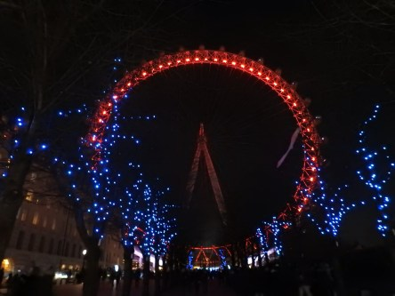
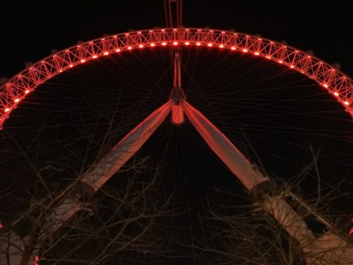
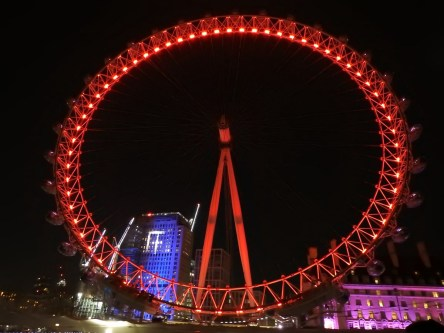
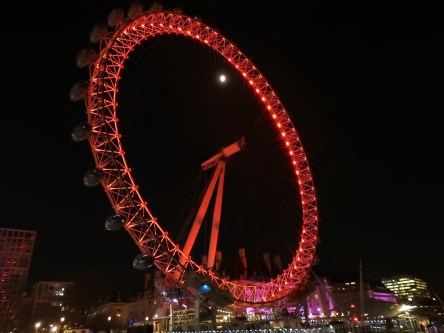
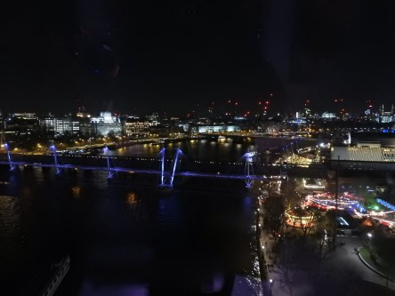

**Sista inlägget 2017**

_Med bilder från London Eye vill jag tacka alla som besökt min blogg det här året och hoppas att ni återkommer 2018._

 _London Eye i härligt solljus._

 _Ett lysande London Eye en härlig men kall kväll._

 _Utsikt uppe från det världskända ögat i London._

 _Vy från bron över till Big Ben._

_Ett härligt 2018 önskar jag alla som besöker min blogg._
