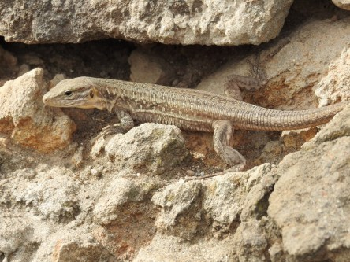

**Små ödlor på Gran Canaria**

_De här små ödlorna levde i en stenmur i Iglesia de San Juan, Arucas. De var snabba och sprang ut och in genom hålen i stenmuren. Det fanns både små och lite större ödlor._

 _Visst är de söta?_
