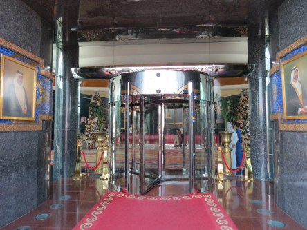
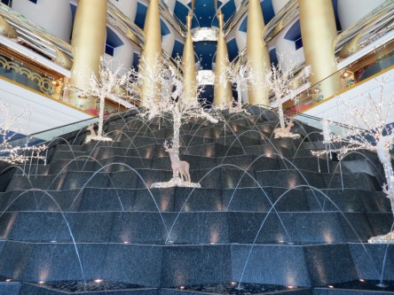
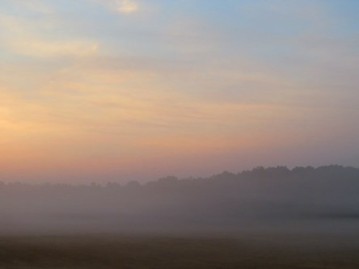
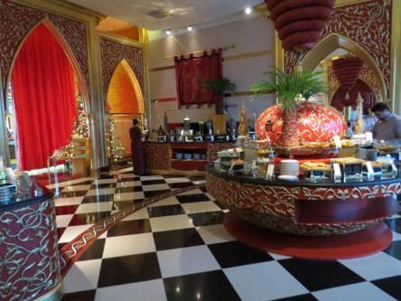
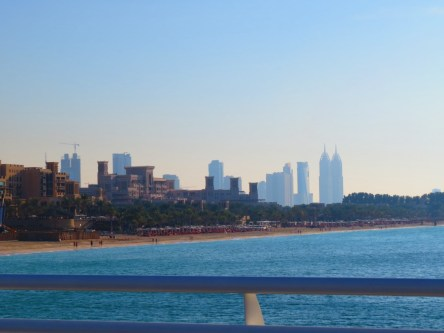

**Burj Al Arab i Dubai**

_Här har jag plockat fram lite semesterminnen från vår senaste resa till Dubai. Bilderna är från vår middag i världens enda sjustjärniga hotell Burj Al Arab. Här har världens alla kändisar en egen lägenhet och lyxen är kopiös. För en dag provade vi på detta liv, och jag kan nog säga att vi kände oss en aning malplacerade. Men roligt var det._

 _Ingången till Burj Al Arab._

 _Här tittar vi upp på andra våningen._

 _Här är vi på andra våningen där vår restaurang ligger._

 _Här åt vi vår middag som var oerhört god. Vi hade helt egna uppassare som hela tiden servade oss. Vi behövde inte ens fylla på våra glas själva._

 _Middagen är över och vi väntar på vår privatchaufför som ska köra oss tillbaks till verkligheten igen._

 _Vy mot Downtown Dubai sett från Burj Al Arab._

 _En sista blick tillbaks innan vi åker hem till vårt eget, inte lika lyxiga hotell. Det var dock roligt att få prova på att leva lyxliv för en dag._
