**Från Edinburgh till Oban**

_I en serie inlägg framöver vill jag visa både kända och okända delar av Skottland. Resan börjar i Edinburgh och sträcker sig över i stort sett hela Skottland och tillbaks igen. I del ett börjar vi i Edinburgh och fortsätter upp till Oban._

 _En av alla mysiga restauranger i Edinburgh._

[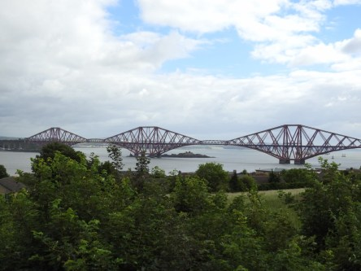](https://worldwideweatherblog.wordpress.com/wp-content/uploads/2017/08/dscn6288-desktop-resolution.jpg) _Första stoppet är med utsikt över Edinburghs berömda broar. Här är deras stolthet: Järnvägsbron Firth of Forth._

[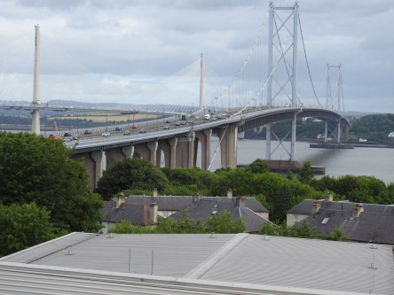](https://worldwideweatherblog.wordpress.com/wp-content/uploads/2017/08/dscn6290-desktop-resolution.jpg) _Här ser man den gamla bilbron som är på väg att rasa._

[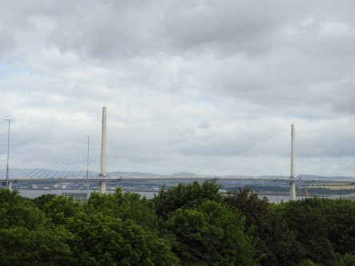](https://worldwideweatherblog.wordpress.com/wp-content/uploads/2017/08/dscn6294-desktop-resolution.jpg) _Och här är den nya som ska ersätta den gamla._

[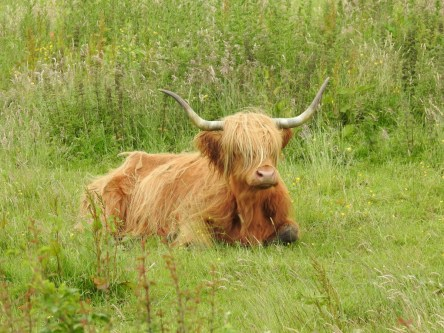](https://worldwideweatherblog.wordpress.com/wp-content/uploads/2017/08/dscn6330-desktop-resolution.jpg) _Och vad är en resa i Skottland utan dessa Highland Cattle kossor._

[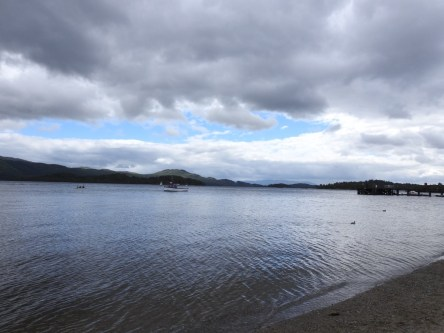](https://worldwideweatherblog.wordpress.com/wp-content/uploads/2017/08/dscn6342-desktop-resolution.jpg)

 _Nu har vi kommit fram till Loch Lomond. Och vädret är: Skotskt. Det vill säga changeable. Just nu bestämde det sig för att regna._

 _Men en liten tur i byn var ändå nödvändigt. Dessa små mysiga gator vill man inte missa oavsett väder. Och med ett ihärdigt torkande av kameralinsen gick det att få bilder utan regndroppar._

 _Färden går vidare bland berg och dalar._

 _Nu är vi framme i den lilla byn Inverary._

 _En tur upp till det vackra slottet Inverary Castle är ett måste._

[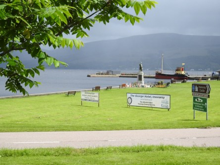](https://worldwideweatherblog.wordpress.com/wp-content/uploads/2017/08/dscn6437-desktop-resolution.jpg) _Utsikt ner mot hamnen från vägen till slottet._

 _Här ser vi Kilchurn Castle vid Lochawe._

[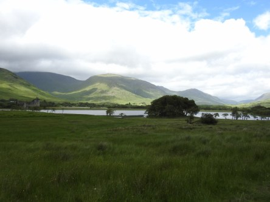](https://worldwideweatherblog.wordpress.com/wp-content/uploads/2017/08/dscn6458-desktop-resolution.jpg) _Vi kör vidare bland vackra sjöar och berg._

 _På väg upp till Oban_

[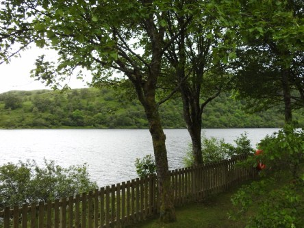](https://worldwideweatherblog.wordpress.com/wp-content/uploads/2017/08/dscn6512-desktop-resolution.jpg) _Ett litet stopp för fika och lite avkoppling._

[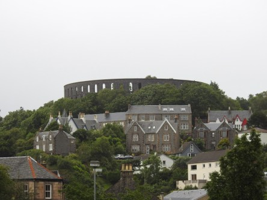](https://worldwideweatherblog.wordpress.com/wp-content/uploads/2017/08/dscn6589-desktop-resolution.jpg) _Framme i Oban med utsikt mot [McCaigs Tower](https://en.wikipedia.org/wiki/McCaig%27s_Tower) som på håll ser ut som Colosseum i Rom._

[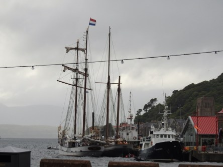](https://worldwideweatherblog.wordpress.com/wp-content/uploads/2017/08/dscn6621-desktop-resolution.jpg)

[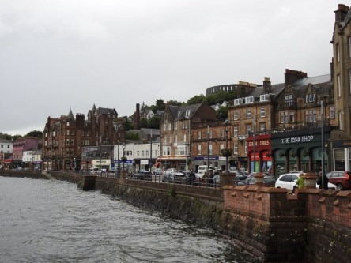](https://worldwideweatherblog.wordpress.com/wp-content/uploads/2017/08/dscn6622-desktop-resolution.jpg)

[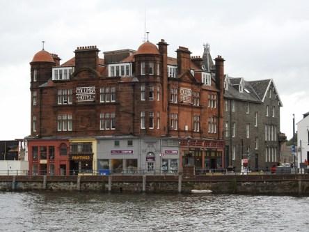](https://worldwideweatherblog.wordpress.com/wp-content/uploads/2017/08/dscn6637-desktop-resolution.jpg)

 _En kvällspromenad i Oban bjuder på mycket att se och även det berömda Skotska vädret med omväxlande sol,regn och blåst._

I del två åker vi över till Iona och Staffa.

Spara
