**Isle of Skye del 5**

_Idag åker vi vidare till Portree som är öns huvudstad. Staden är inte så stor så man behöver inte så mycket tid för att hinna gå runt och se det mesta här. Däremot vill man gärna ha gott om tid för att hinna njuta av denna mysiga lilla stad med sina färgglada hus._

 _På väg mot huvudstaden på ön._

[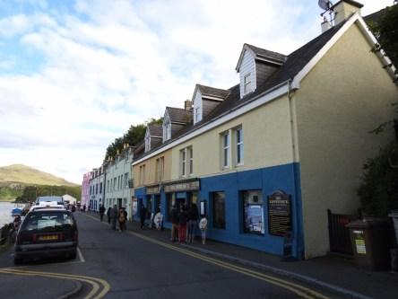](https://worldwideweatherblog.wordpress.com/wp-content/uploads/2017/12/dscn8134-desktop-resolution.jpg)

 _Den här gatan med sina färgglada hus är väl den mest kända i Portree. Söker man på staden så är det mest dessa hus man får upp._

[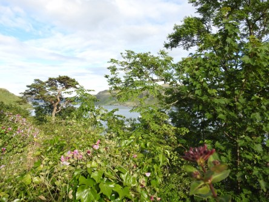](https://worldwideweatherblog.wordpress.com/wp-content/uploads/2017/12/dscn8147-desktop-resolution.jpg) _Utsikten från gatan och från bron ovanför är fantastisk._

[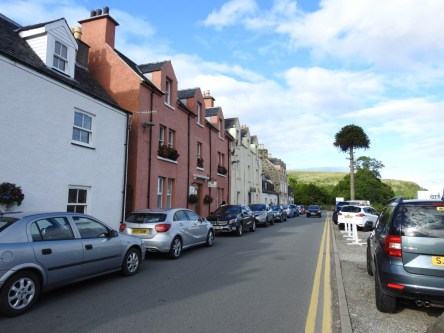](https://worldwideweatherblog.wordpress.com/wp-content/uploads/2017/12/dscn8138-desktop-resolution.jpg)

[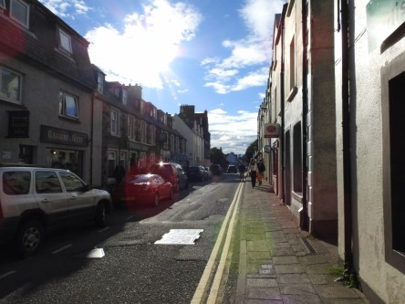](https://worldwideweatherblog.wordpress.com/wp-content/uploads/2017/12/dscn8163-desktop-resolution.jpg) _Efter en liten rundvandring på stans gator börjar vi närma oss det lilla torget._

[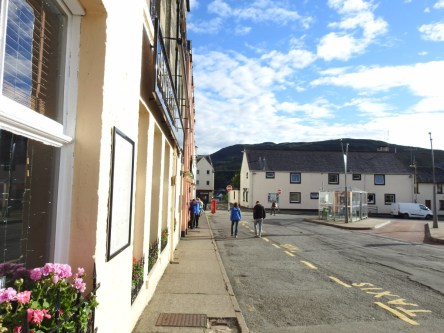](https://worldwideweatherblog.wordpress.com/wp-content/uploads/2017/12/dscn8168-desktop-resolution.jpg)

[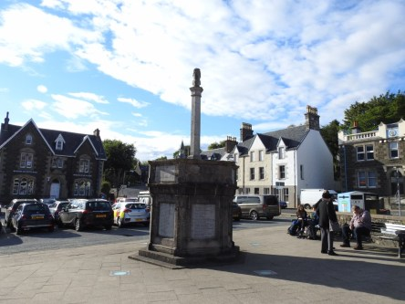](https://worldwideweatherblog.wordpress.com/wp-content/uploads/2017/12/dscn8174-desktop-resolution.jpg)

[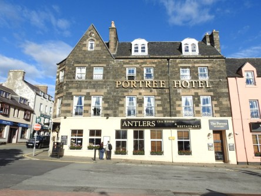](https://worldwideweatherblog.wordpress.com/wp-content/uploads/2017/12/dscn8198-desktop-resolution.jpg)

 _Torget är väldigt litet men så mysigt och även här har husen mycket färg._

[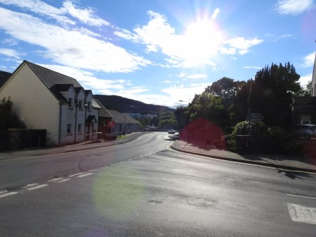](https://worldwideweatherblog.wordpress.com/wp-content/uploads/2017/12/dscn8184-desktop-resolution.jpg) _Nu lämnar vi staden och snart även denna helt underbara ö._ _Jag hoppas att vi får möjlighet att komma tillbaks en dag igen._

[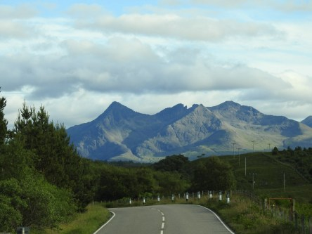](https://worldwideweatherblog.wordpress.com/wp-content/uploads/2017/12/dscn8205-desktop-resolution.jpg)

[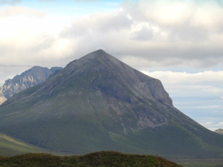](https://worldwideweatherblog.wordpress.com/wp-content/uploads/2017/12/dscn8222-desktop-resolution.jpg)

[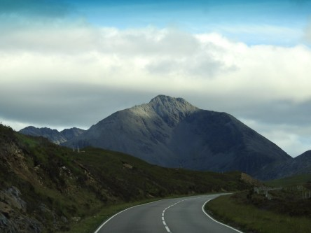](https://worldwideweatherblog.wordpress.com/wp-content/uploads/2017/12/dscn8255-desktop-resolution.jpg) _Vår färd mot fastlandet kantas av slingriga vägar och vackra vulkaner och berg. Vi lämnar motvilligt den här ön._

[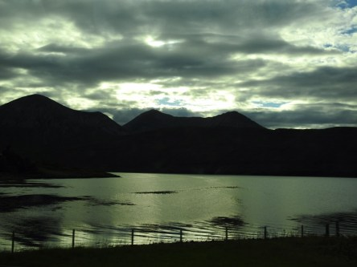](https://worldwideweatherblog.wordpress.com/wp-content/uploads/2017/12/dscn8281-desktop-resolution.jpg) _Med denna vackra solnedgång så avslutar jag den här serien från Ilse of Skye._

_I nästa inlägg går färden vidare på fastlandet._
