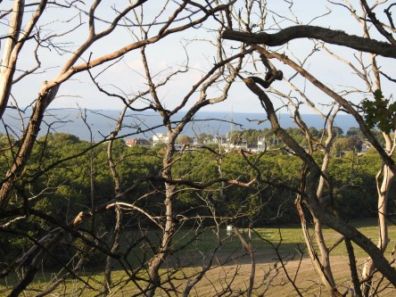
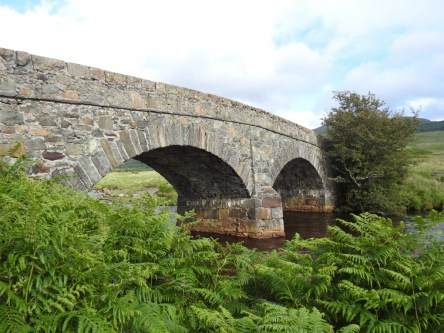
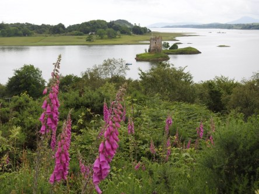
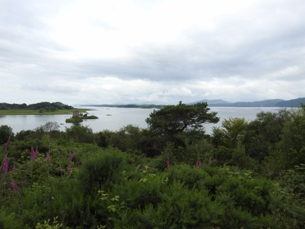

**Från Iona till Castle Stalker**

_Idag åker vi vidare genom Skottlands vackra landskap och når fram till Castle Stalker. I det här slottet spelades en del scener från Monty Python and the Holy Grail in. Vägen dit är full av underbara naturupplevelser._

 _Vägen vidare genom Höglandet är storslagen. Man är väldigt tacksam för att det finns digitalkameror idag istället för de gamla med rulle. Man tar lätt flera tusen bilder på en sån här resa._

 _Det finns gott om märkliga broar i Skottland._

 _Här är vi framme vid slottet och redo att ta bilder._

 _Slottet ligger ute på en pytteliten ö som bara kan nås med båt._

 _Omgivningen där vi står är så vacker. Som syns på bilden är det en bra bit ut till slottet._

 _En sista närbild innan vi åker vidare till nästa ställe._

_I nästa inlägg går färden vidare genom Höglandet och allt som finns att se där._

https://www.youtube.com/watch?v=3lcsa87ZDCM

Här är en liten film som visar hur det ser ut på ön och dess omgivning. Filmen är från Youtube och är filmad av David Laurie.
