**Bland berg och dalar på vägen till Glencoe**

_Vi åker vidare från Castle Stalker genom ett helt otroligt landskap omgivna av höga berg och djupa dalar. Färden går mot Glencoe visitor centre. Där bjuds det på andlöst vacker natur._

[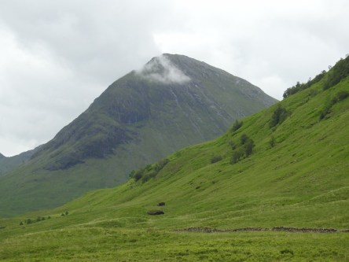](https://worldwideweatherblog.wordpress.com/wp-content/uploads/2017/09/dscn7136-desktop-resolution.jpg)

[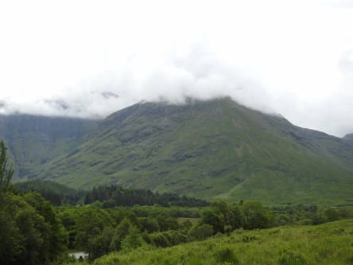](https://worldwideweatherblog.wordpress.com/wp-content/uploads/2017/09/dscn7137-desktop-resolution.jpg)

[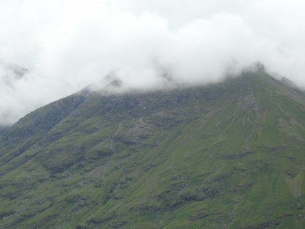](https://worldwideweatherblog.wordpress.com/wp-content/uploads/2017/09/dscn7143-desktop-resolution.jpg) _Färden går vidare bland molnklädda bergstoppar._

[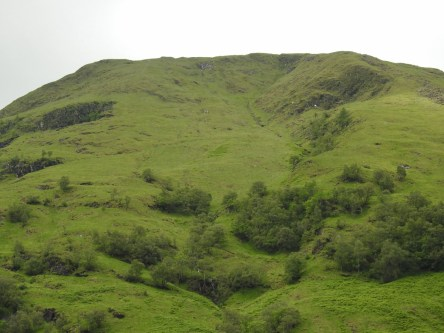](https://worldwideweatherblog.wordpress.com/wp-content/uploads/2017/09/dscn7145-desktop-resolution.jpg)

[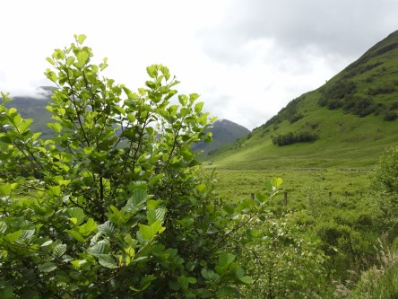](https://worldwideweatherblog.wordpress.com/wp-content/uploads/2017/09/dscn7147-desktop-resolution.jpg)

[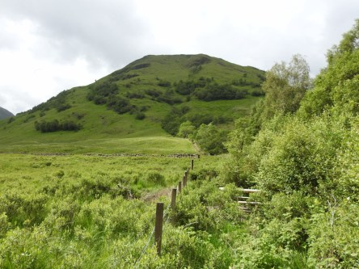](https://worldwideweatherblog.wordpress.com/wp-content/uploads/2017/09/dscn7151-desktop-resolution.jpg)

[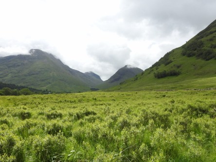](https://worldwideweatherblog.wordpress.com/wp-content/uploads/2017/09/dscn7152-desktop-resolution.jpg)

[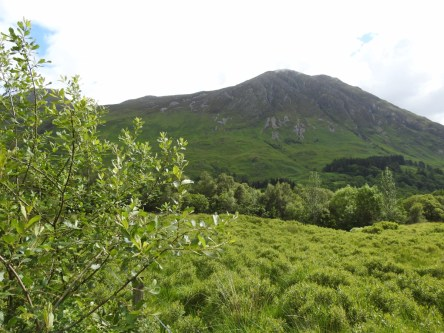](https://worldwideweatherblog.wordpress.com/wp-content/uploads/2017/09/dscn7154-desktop-resolution.jpg) _Här har vi nått fram till Glencoe och vandrar ut i en fantstisk miljö._

[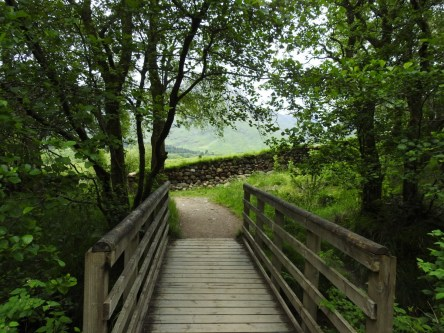](https://worldwideweatherblog.wordpress.com/wp-content/uploads/2017/09/dscn7163-desktop-resolution.jpg)

[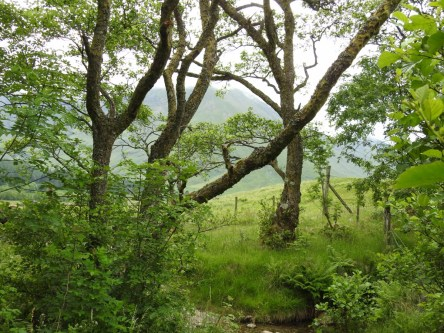](https://worldwideweatherblog.wordpress.com/wp-content/uploads/2017/09/dscn7172-desktop-resolution.jpg)

[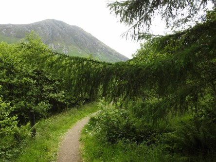](https://worldwideweatherblog.wordpress.com/wp-content/uploads/2017/09/dscn7192-desktop-resolution.jpg) _Det är helt fantastiskt avkopplande att gå omkring och inandas den skottska naturen._

[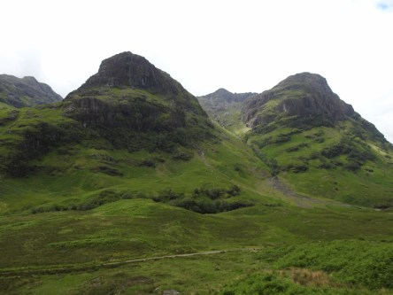](https://worldwideweatherblog.wordpress.com/wp-content/uploads/2017/09/dscn7199-desktop-resolution.jpg)

[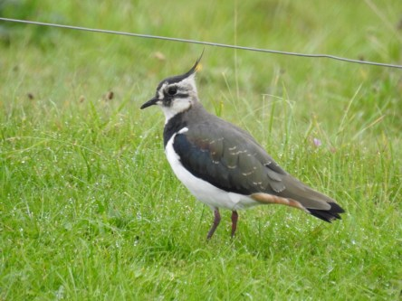](https://worldwideweatherblog.wordpress.com/wp-content/uploads/2017/09/dscn7211-desktop-resolution.jpg) _Vi åker vidare bland de magnifika bergen i Glencoe. Det finns otroligt mycket mer att se i detta fantastiska landskap och det kräver betydligt mer än ett besök för att se allt. Jag hoppas vi kan återkomma dit snart igen. I nästa inlägg fortsätter färden till Fort William och Plockton._
