**Isle Of Skye Del 1**

_Idag går färden över till det fantastiskt vackra Isle Of Skye. Det är så otroligt mycket att se här att det inte får plats i ett inlägg. Så här kommer första delen från Isle Of Skye._

[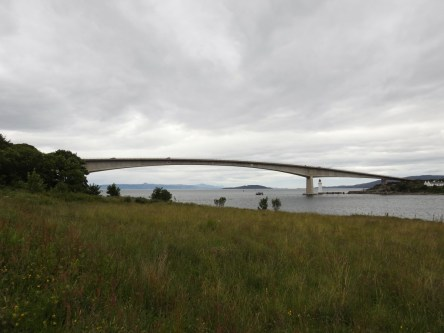](https://worldwideweatherblog.wordpress.com/wp-content/uploads/2017/10/dscn7647-desktop-resolution.jpg)

 _Här har vi precis kört över bron till vulkanön Isle Of Skye._

[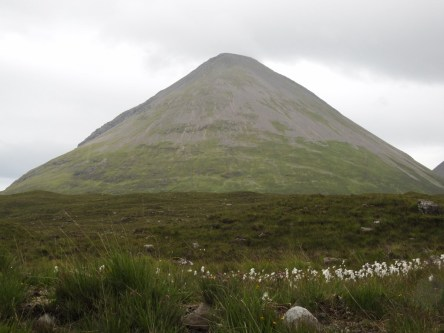](https://worldwideweatherblog.wordpress.com/wp-content/uploads/2017/10/dscn7681-desktop-resolution.jpg)

[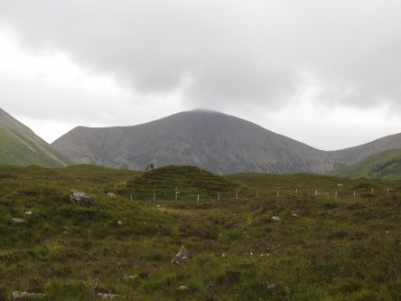](https://worldwideweatherblog.wordpress.com/wp-content/uploads/2017/10/dscn7692-desktop-resolution.jpg) _Här stannar vi till för att se och njuta av det otroligt vackra vulkanlandskapet med både röda och svarta vulkaner. En del av dem är inbäddade i moln._

[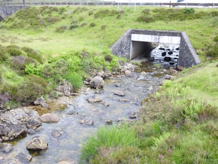](https://worldwideweatherblog.wordpress.com/wp-content/uploads/2017/10/dscn7706-desktop-resolution.jpg)

[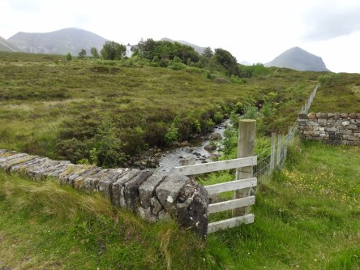](https://worldwideweatherblog.wordpress.com/wp-content/uploads/2017/10/dscn7708-desktop-resolution.jpg) _Färden går vidare med små stopp för att beundra det vackra landskapet med vulkaner, berg och massor av små vattendrag._

 _Nu har vi nått fram till Glenbrittle där vi ska gå ner till en av de svarta vulkanstränderna på ön. Tyvärr regnade det en del här så det var svårt att undvika regndroppar på linsen. Så vädret avspeglar sig på vissa bilder i form av regndroppar._

[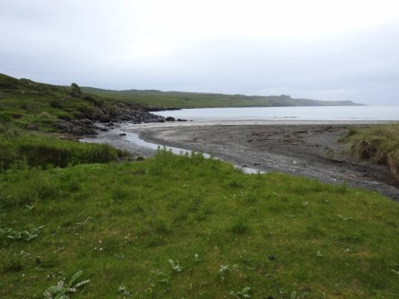](https://worldwideweatherblog.wordpress.com/wp-content/uploads/2017/10/dscn7725-desktop-resolution.jpg)

[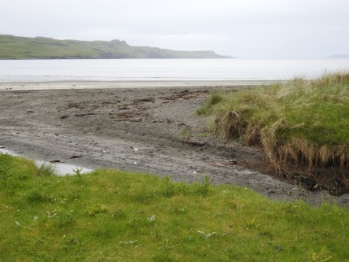](https://worldwideweatherblog.wordpress.com/wp-content/uploads/2017/10/dscn7729-desktop-resolution.jpg) _Här står vi vid stranden som består av svart aska från vulkaner. Det var inte direkt badväder så vi nöjde oss med att bara ta bilder._

[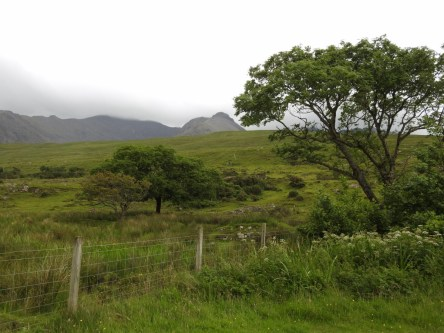](https://worldwideweatherblog.wordpress.com/wp-content/uploads/2017/10/dscn7733-desktop-resolution.jpg) _Sen utforskar vi naturen runt omkring._

[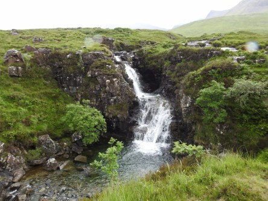](https://worldwideweatherblog.wordpress.com/wp-content/uploads/2017/10/dscn7739-desktop-resolution.jpg)

[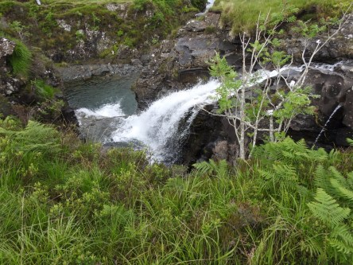](https://worldwideweatherblog.wordpress.com/wp-content/uploads/2017/10/dscn7749-desktop-resolution.jpg)

[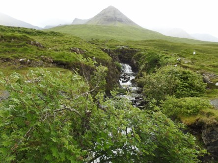](https://worldwideweatherblog.wordpress.com/wp-content/uploads/2017/10/dscn7770-desktop-resolution.jpg) _Vid nästa stopp är vi omgivna av svarta vulkaner och vackra vattenfall. Det regnar fortfarande och regndropparna syns på en del av bilderna._

 _Vi avslutar den här delen av vårt besök på Skye med ett besök på öns enda whiskeydestilleri Talisker._

_I nästa inlägg fortsätter vår rundtur på Skye_
