**Isle of Skye del 2**

_Idag fortsätter vår rundtur på Isle of Skye och den här gången är vi på väg nästan så långt upp vi kan komma på Skye och kör förbi den hamn där båten som går över till Yttre Hebriderna går. Tyvärr var vi inte över dit men jag har zoomat in och tagit en hel del bilder på Yttre Hebriderna som jag visar i det här inlägget._

[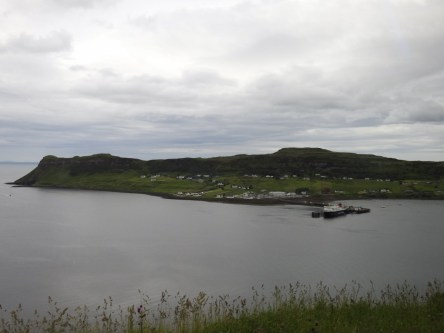](https://worldwideweatherblog.wordpress.com/wp-content/uploads/2017/10/dscn7781-desktop-resolution.jpg)

[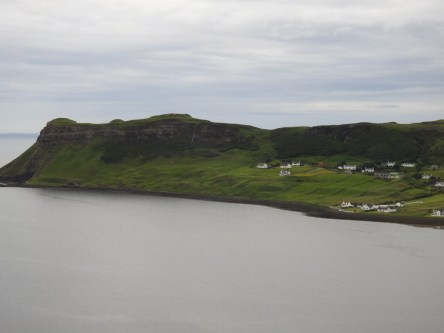](https://worldwideweatherblog.wordpress.com/wp-content/uploads/2017/10/dscn7782-desktop-resolution.jpg)

[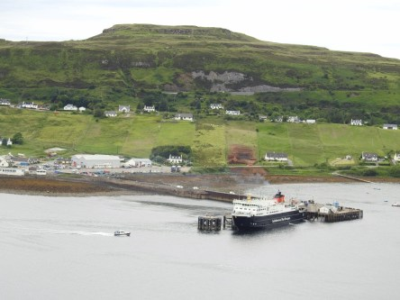](https://worldwideweatherblog.wordpress.com/wp-content/uploads/2017/10/dscn7785-desktop-resolution.jpg) _Här ser man hamnen där båten till Yttre Hebriderna går._

[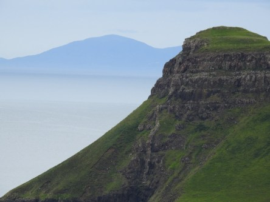](https://worldwideweatherblog.wordpress.com/wp-content/uploads/2017/10/dscn7792-desktop-resolution.jpg)

[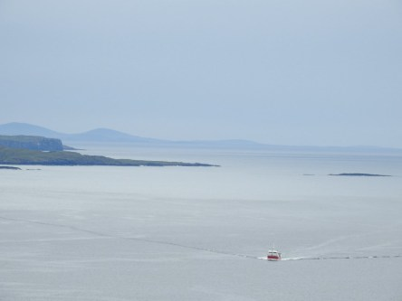](https://worldwideweatherblog.wordpress.com/wp-content/uploads/2017/10/dscn7793-desktop-resolution.jpg)

 _Långt där borta ser man konturerna av Y.H._

[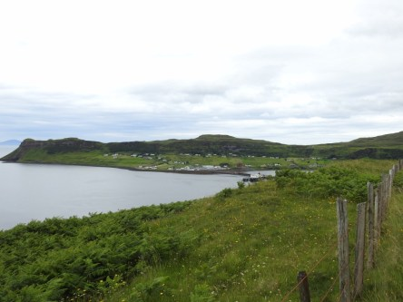](https://worldwideweatherblog.wordpress.com/wp-content/uploads/2017/10/dscn7796-desktop-resolution.jpg)

[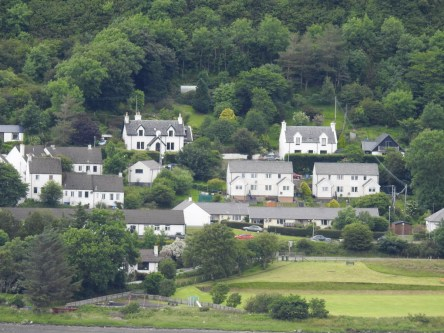](https://worldwideweatherblog.wordpress.com/wp-content/uploads/2017/10/dscn7810-desktop-resolution.jpg) _Utsikt ner till den lilla byn som ligger vid hamnen där båten går._

 _Närbild på båten som jag hoppas kunna åka med en dag._

[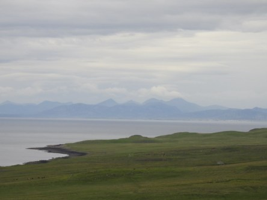](https://worldwideweatherblog.wordpress.com/wp-content/uploads/2017/10/dscn7818-desktop-resolution.jpg)

[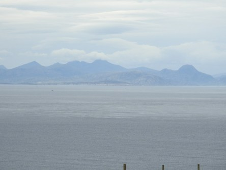](https://worldwideweatherblog.wordpress.com/wp-content/uploads/2017/10/dscn7851-desktop-resolution.jpg)

[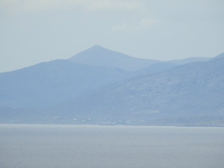](https://worldwideweatherblog.wordpress.com/wp-content/uploads/2017/10/dscn7859-desktop-resolution.jpg)

[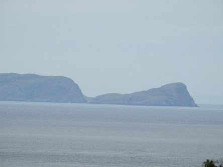](https://worldwideweatherblog.wordpress.com/wp-content/uploads/2017/10/dscn7862-desktop-resolution.jpg) _Här har jag zoomat in Yttre Hebriderna och trots att vädret inte var det bästa så kunde man tydligt se dessa fantastiska öar som är väldigt glest befolkade._

_I nästa del fortsätter vår rundtur på Skye._
