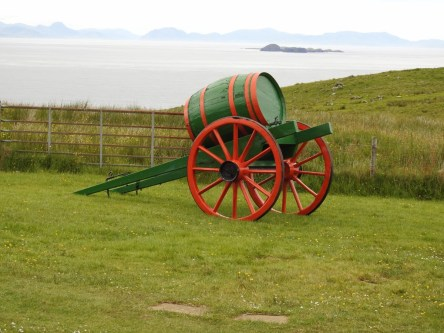
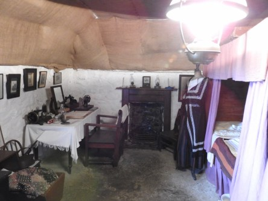
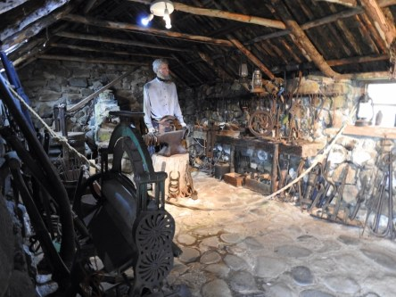
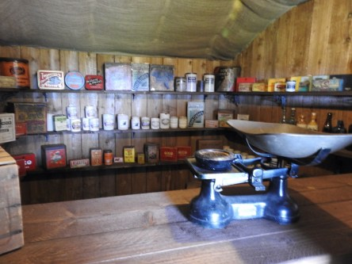
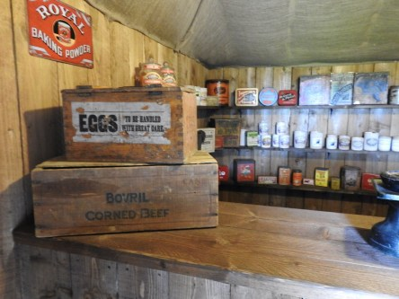
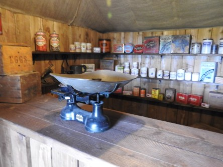

**Små hus på Isle of Skye**

_Dessa små hus visar hur folk levde på ön för längesedan. Där fanns en affär och plats för kor och mycket annat. Vissa hus var till och med riktigt lyxiga med fina sängar och kläder._

