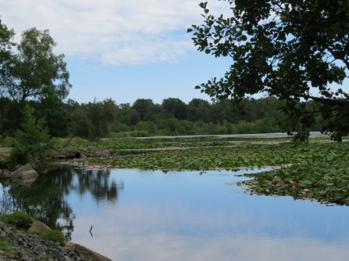
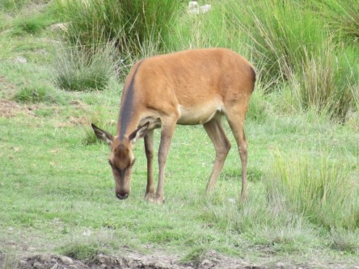
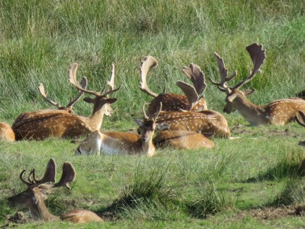
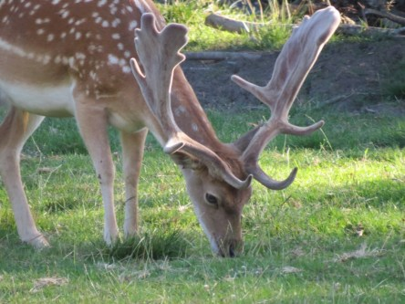
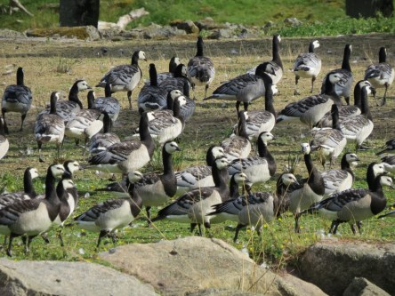

**Lite sommar när det är som mörkast**

_När det blir mörkt och kallt kan det pigga upp med lite sommarbilder. Här har jag plockat ut lite som är tagna på Eriksbergs viltreservat i Karlshamn förra sommaren._

 _Härliga näckrosor._

 _Fantastisk natur._

 _Ett rikt djur och fågelliv._
