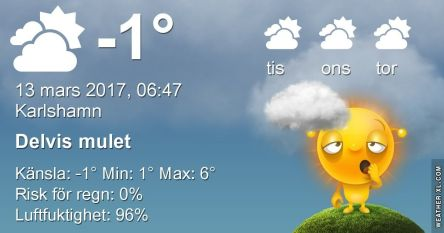

 _Idag finns det chans till sol mellan molnen och kring 6 grader varmt. Tisdag blir milt och molnigt och onsdag mest soligt och varmt. Resten av veckan ser ut att bli mest molnigt och milt._ _Även nätterna blir varmare nu. Mer väder hittar du [här](http://www.vackertvader.se/asarum/10d/yr-smhi)._

Spara
