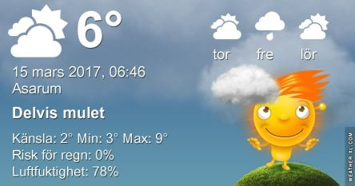

 _Morgonen är molnig och blåsig. Under dagen finns chans till lite sol och omkring 9 grader. Torsdagen blir ganska solig och upp till 10 grader och inte fullt så blåsigt som idag. Fredag ser ut att bli molnig och kring 8 grader. I helgen blir det en del sol och något lägre temperatur. Mer väder ser du [här](http://www.vackertvader.se/asarum/10d/yr-smhi)._
