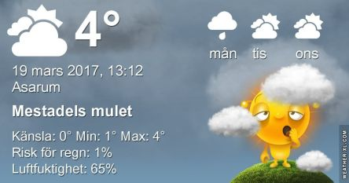

 _Mest mulet på dagen med omkring 6 grader. Måndag blir också molnig men något varmare, kring 9 grader. Tisdag upp till 10 grader och en hel del sol. Längre prognos ser du [här](http://www.vackertvader.se/asarum/10d/yr-smhi)._
