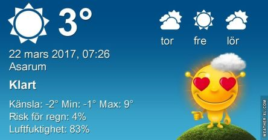

 _Dagen börjar med sol och kallt. Resten av dagen blir solig och upp till 10 grader. Torsdag blir mest solig och omkring 10 grader. Fredagen blir även den mest soligt och omkring 9 grader. En längre prognos ser du [här](http://www.vackertvader.se/asarum/10d/yr-smhi)._
