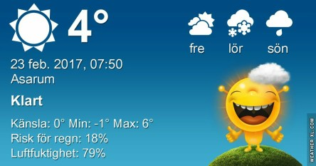

 _Efter att det tillfälligt klarnade upp på morgonen så mulnar det på igen. Vinden har avtagit och framåt kvällen väntas regn. Resten av veckan blir mest mild och molnig. Nätterna till helgen bli kalla._

Spara
