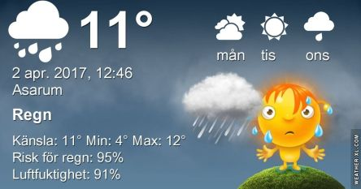

Efter en kall natt mulnar det på och det är risk för regn under eftermiddagen Temperaturen hamnar på upp till 14 grader. Måndagen bjuder på en del sol med temperatur på omkring 15 grader. Tisdagen blir kallare med högst upp till 10 grader och en del sol. En längre prognos ser du [här](http://www.vackertvader.se/asarum/10d/yr-smhi).
