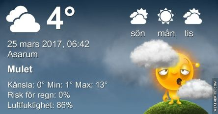

 _Dagen börjar med molnighet som framåt dagen minskar. Det blir varmt med upp till 13 grader. Söndagen blir solig med omkring 15 grader. Måndag blir något svalare med sol och upp till 12 grader. En längre prognos ser du [här](http://www.vackertvader.se/asarum/10d/yr-smhi)._
