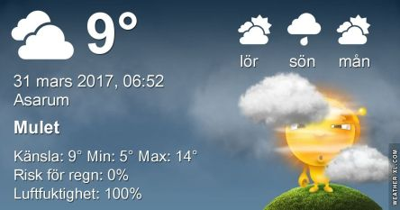

 _Dagen börjar med lätt regn och disigt. Det blir fortsatt mest molnigt resten av dagen och omkring 13 grader. Lördagen blir varm med upp till 20 grader och en del sol mellan molnen. Söndag blir molnig och omkring 16 garder. En längre prognos ser du [här](http://www.vackertvader.se/asarum/10d/yr-smhi)._
