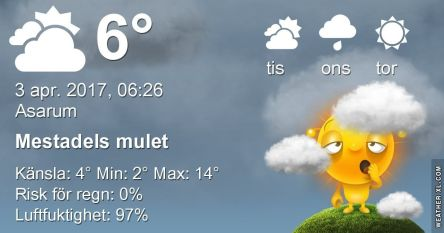

 _Dagen börjar med molnighet men under dagen blir det mer sol. Omkring 16 grader. Tisdagen börjar med växlande molnighet och fram mot kvällen minskar molnen och det blir dimma och kallare. På dagen omkring 15 grader och på kvällen och natten någon enstaka plusgrad. Onsdagen börjar molnigt och sedan em del sol och även någon regnskur. Omkring 11 grader. En längre prognos ser du [här](http://www.vackertvader.se/asarum/10d/yr-smhi)._
