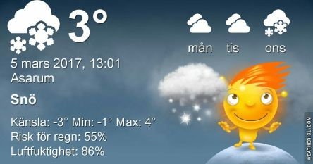

 _Risk för snö eller snöblandat regn ikväll. Blåsigt och mulet hela dagen. Fram till mitten av veckan fortsätter det med snö eller snöblandat och bara enstaka plusgrader dagtid och kalla nätter. Från torsdag stiger temperaturen igen och det blir omkring 6 plusgrader dagtid och en hel del sol. Nätterna blir varmare också._
