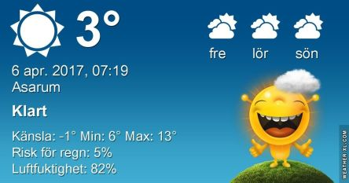

 _Dagen börjar soligt med tunna slöjmoln. Solen fortsätter att skina under resten av dagen och det blir omkring 14 grader. Fredagen blir solig och upp till 18 grader. Lördag blir mer molnig och upp till 17 grader. En längre prognos ser du [här](http://www.vackertvader.se/asarum/10d/yr-smhi)._
