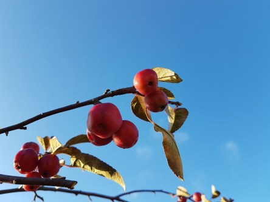

Idag går solen upp 07:28 och ned 15:59. Månen går upp 23:49 och ned 13:57 Månen är belyst 48 %. Dagens längd är 8 timmar och 31 minuter.

 Molnigt och en del regn 2,9 C  Vindby 2 m/s NE  Luftfuktighet 97 %  hPa 986  Regn 4,5 mm Kl.02:30

 Regn 2,8 C  Vindby 4,4 m/s NE  Luftfuktighet 89 %  hPa 986  Regn 4,5 mm Kl.06:25

 Blåsigt 8,3 C  Vindby 7,4 m/s SSE  Luftfuktighet 59 %  hPa 987   Regn 5 mm Kl.14:20

 Molnigt 2,8 C  Vindby 2 m/s NE  Luftfuktighet 89 %  hPa 988 Kl.19:55

 

Högst och lägst uppmätta temperatur igår (inofficiellt privat mätare): Max 9,5 C , Min 3,8 C Högst uppmätta vind 3,1 m/s. Högst uppmätta vindby 7,4 m/s.

Högst och lägst uppmätta temperatur igår (officiellt enligt [YR.NO](http://www.vackertvader.se/v%C3%A4derstation/karlshamn?utm_source=email&utm_medium=email&utm_campaign=asarum)) Max 8,6 C, Min 3 C Högst uppmätta vind 3 m/s. Högst uppmätta vindby 8,2 m/s

 

 Blåsigt men också blå himmel och en del sol idag.

Spara

Spara

Spara

Spara
