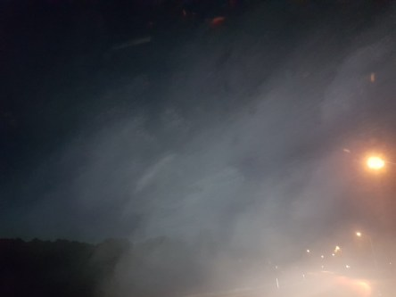

Idag går solen upp 06:25 och ned 19:27. Månen går upp 22:36 och ned 13:56 Månen är belyst 64 %. Dagens längd är 13 timmar och 2 minuter.

 Klart 11,4 C  Vindstilla  Luftfuktighet 97 %  hPa 991 Kl.01:15

 Halvklart 9,7 C   Vindby 1 m/s ESE  Luftfuktighet 99 %  hPa 991  Regn 0,7 mm Kl.06:40

 Mest molnigt 18,2 C  Vindby 3,4 m/s N  Luftfuktighet 76 %  hPa 994 Kl.13:30

 Mest klart 11,1 C  Vindby 2,2 m/s N  Luftfuktighet 96 %  hPa 996 Kl.21:10

 

Högst och lägst uppmätta temperatur igår (inofficiellt privat mätare): Max 20,1 C , Min 11,9 C Högst uppmätta vind 3,4 m/s. Högst uppmätta vindby 7,4 m/s.

Högst och lägst uppmätta temperatur igår (officiellt enligt [YR.NO](http://www.vackertvader.se/v%C3%A4derstation/karlshamn?utm_source=email&utm_medium=email&utm_campaign=asarum)) Max 16,9 C, Min 10,2 C Högst uppmätta vind 3,4 m/s. Högst uppmätta vindby 7,9 m/s

 

 Det var väldigt dimmigt bitvis på  natten.

Spara

Spara

Spara

Spara

Spara
