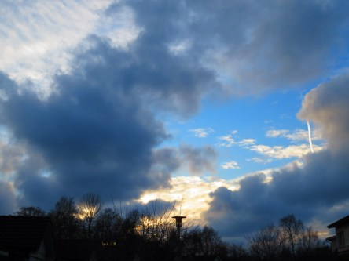

Idag går solen upp 08:24 och ned 15:24. Månen går upp 02:36 och ned 13:46 Månen är belyst 24 %. Dagens längd är 7 timmar och 0 minuter.

 Molnigt 0,2 C  Vindby 2 m/s WNW  Luftfuktighet 89 %  hPa 999 Kl.02:25

 Molnigt 2,4 C  Vindby 5,4 m/s S  Luftfuktighet 92 %  hPa 1000  Regn 0,7 mm Kl.06:30

 Molnigt 3,7 C  Vindby 4,6 m/s SE  Luftfuktighet 78 %  hPa 997 Kl.13:25

 Blåsigt och molnigt 2,8 C  Vindby 6,5 m/s NW  Luftfuktighet 80 %  hPa 990 Kl.20:00

 

 Blåsig och kall dag. Och grått.

 

Högst och lägst uppmätta temperatur igår (inofficiellt privat mätare): Max 2,8 C , Min – 2,5 C Högst uppmätta vind 2,4 m/s. Högst uppmätta vindby 4,4 m/s.

Högst och lägst uppmätta temperatur igår (officiellt enligt [YR.NO](http://www.vackertvader.se/v%C3%A4derstation/karlshamn?utm_source=email&utm_medium=email&utm_campaign=asarum)) Max 2,5 C, Min – 2 C Högst uppmätta vind 4,2 m/s. Högst uppmätta vindby 9,7 m/s

 

 Kvällshimlen bjöd på många färger idag.
