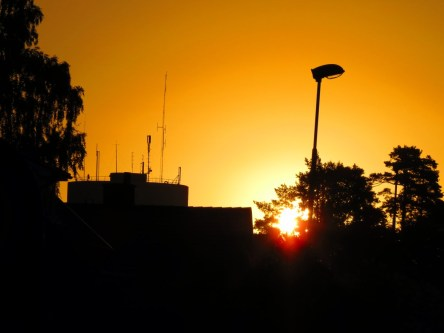

Idag går solen upp 05:27 och ned 20:41. Månen går upp 23:25 och ned 13:29 Månen är belyst 61 %. Dagens längd är 15 timmar och 14 minuter.

 Klart 4,4 C  Vindstilla  Luftfuktighet 98 %  hPa 1016 Kl.02:30

 Klart  4,7 C  Vindstilla  Luftfuktighet 98 %  hPa 1017 Kl.06:30

 Växlande molnighet 23,2 C  Vindby 2 m/s N  Luftfuktighet 44 %  hPa 1019 Kl.13:45

 Halvklart  12,4 C  Vindstilla  Luftfuktighet 76 %  hPa 1020 Kl.20:40

 

Högst och lägst uppmätta temperatur igår (inofficiellt privat mätare): Max 23,6 C , Min 8,5 C Högst uppmätta vind 4,4 m/s. Högst uppmätta vindby 7,1 m/s.

Högst och lägst uppmätta temperatur igår (officiellt enligt [YR.NO](http://www.vackertvader.se/v%C3%A4derstation/karlshamn?utm_source=email&utm_medium=email&utm_campaign=asarum)) Max 19,5 C, Min 7,9 C Högst uppmätta vind 4,1 m/s. Högst uppmätta vindby 11,2 m/s

 

Spara

Spara

Spara
