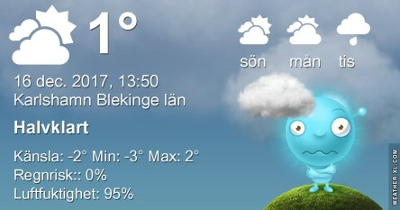

Idag går solen upp 08:27 och ned 15:24. Månen går upp 06:04 och ned 14:53 Månen är belyst 4 %. Dagens längd är 6 timmar och 57 minuter.

 Mest molnigt - 1,5 C  Vindstilla  Luftfuktighet 97 %  hPa 991 Kl.02:40

 Molnigt - 0,9 C  Vindby 0,7 m/s N  Luftfuktighet 98 %  hPa 992 Kl.07:00

 Växlande molnighet 1,4 C  Vindstilla  Luftfuktighet 78 %  hPa 995 Kl.13:50

 Växlande molnighet - 1 C  Vindstilla  Luftfuktighet 89 %  hPa 999 Kl.19:45

 

 

Högst och lägst uppmätta temperatur igår (inofficiellt privat mätare): Max 5,2 C , Min - 0,3 C Högst uppmätta vind 4,1 m/s. Högst uppmätta vindby 6,1 m/s.

Högst och lägst uppmätta temperatur igår (officiellt enligt [YR.NO](http://www.vackertvader.se/v%C3%A4derstation/karlshamn?utm_source=email&utm_medium=email&utm_campaign=asarum)) Max 3,4 C, Min 0,7 C Högst uppmätta vind 2,1 m/s. Högst uppmätta vindby 7,3 m/s

 

 Idag gjorde solen oss den äran för första gången på länge.
