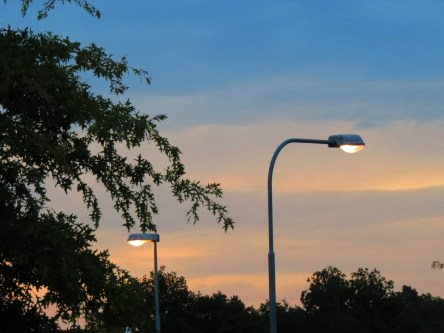

Idag går solen upp 05:31 och ned 20:36. Månen går upp 00:37 och ned 16:05 Månen är belyst 38 %. Dagens längd är 15 timmar och 5 minuter.

 Växlande molnighet 15,1 C  Vindby 2 m/s N   Luftfuktighet 90 %  hPa 1012 Kl.02:00

 Molnigt 15,4 C  Vindstilla  Luftfuktighet 97 %  hPa 1010  Regn 1,3 mm Kl.07:00

 Molnigt 24,4 C  Vindby 2,4 m/s S  Luftfuktighet 66 %  hPa 1013 Kl.14:00

 Växlande molnighet 18,8 C  Vindby 1 m/s S  Luftfuktighet 65 %  hPa 1016 Kl.20:05

 

Högst och lägst uppmätta temperatur igår (inofficiellt privat mätare): Max 25,8 C , Min 4,5 C Högst uppmätta vind 3,4 m/s. Högst uppmätta vindby 4,8 m/s.

Högst och lägst uppmätta temperatur igår (officiellt enligt [YR.NO](http://www.vackertvader.se/v%C3%A4derstation/karlshamn?utm_source=email&utm_medium=email&utm_campaign=asarum)) Max 19,9 C, Min 4,3 C Högst uppmätta vind 5,2 m/s. Högst uppmätta vindby 10,2 m/s

 

Spara

Spara

Spara

Spara
