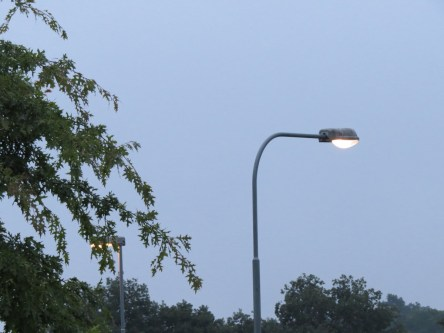

Idag går solen upp 05:35 och ned 20:32. Månen går upp 01:28 och ned 18:18 Månen är belyst 18 %. Dagens längd är 14 timmar och 57 minuter.

 Regn 16,9 C  Vindby 0,4 m/s E  Luftfuktighet 97 %  hPa 1008  Regn 5,5 mm Kl.02:30

 Molnigt 16,5 C  Vindby 1,4 m/s NW  Luftfuktighet 98 %  hPa 1007  Regn 15 mm Kl.06:50

 Molnigt 21,5 C  Vindby 3,4 m/s E  Luftfuktighet 85 %  hPa 1008 Kl.14:55

 Molnigt 18,1 C  Vindstilla  Luftfuktighet 91 %  hPa 1006 Kl.20:00

 

Högst och lägst uppmätta temperatur igår (inofficiellt privat mätare): Max 26,2 C , Min 6,9 C Högst uppmätta vind 2 m/s. Högst uppmätta vindby 3,7 m/s.

Högst och lägst uppmätta temperatur igår (officiellt enligt [YR.NO](http://www.vackertvader.se/v%C3%A4derstation/karlshamn?utm_source=email&utm_medium=email&utm_campaign=asarum)) Max 20,4 C, Min 6,8 C Högst uppmätta vind 3,7 m/s. Högst uppmätta vindby 6,5 m/s

 

Spara

Spara

Spara
