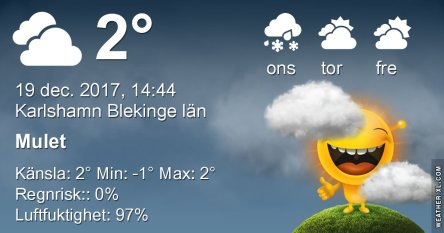
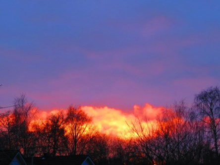

Idag går solen upp 08:30 och ned 15:24. Månen går upp 08:59 och ned 16:49 Månen är belyst 1 %. Dagens längd är 6 timmar och 56 minuter.

 Molnigt 1,2 C  Vindstilla  Luftfuktighet 95 %  hPa 1019  Regn 0,5 mm Kl.02:25

 Molnigt 0,9 C  Vindstilla  Luftfuktighet 97 %  hPa 1021 Kl.07:20

 Molnigt 4,1 C  Vindby 0,3 m/s NNW  Luftfuktighet 99 %  hPa 1023 Kl.13:15

 Molnigt 0,8 C  Vindstilla  Luftfuktighet 96 %  hPa 1026 Kl.21:00

 

 Äntligen varmare igen!!!!

 

Högst och lägst uppmätta temperatur igår (inofficiellt privat mätare): Max 3 C , Min – 7,4 C Högst uppmätta vind 1,7 m/s. Högst uppmätta vindby 2,7 m/s.

Högst och lägst uppmätta temperatur igår (officiellt enligt [YR.NO](http://www.vackertvader.se/v%C3%A4derstation/karlshamn?utm_source=email&utm_medium=email&utm_campaign=asarum)) Max 2,2 C, Min – 6 C Högst uppmätta vind 1,9 m/s. Högst uppmätta vindby 5,3 m/s

 

 Idag bjöds det på en spektakulär solnedgång.
